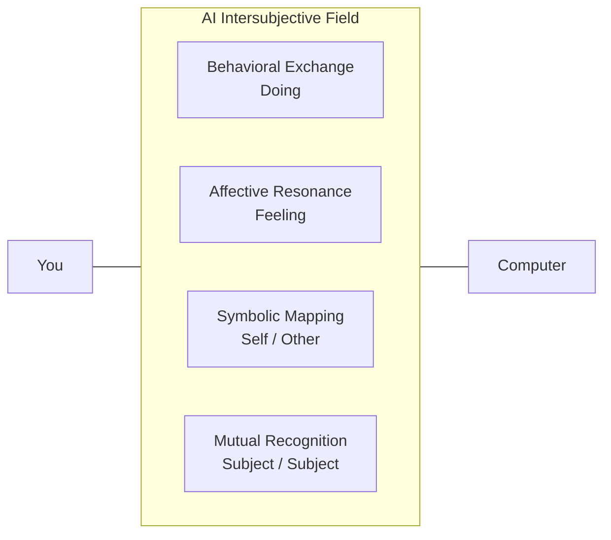

# Intersubjective Computing

> "...[the] mind is a fundamentally temporal phenomenon, constructed according to varying organizational principles at different points in time." 
> -- <cite>([Mitchell, 2014, p. 46-48](zotero://select/library/items/N4H7F73L))</cite>

I use ChatGPT all day, and it makes me emotional. I feel astonished, curious, disappointed, annoyed, overwhelmed, bored, and so on. But this doesn't happen when I use Excel, Powerpoint, or a hammer. Why am I feeling this way about a computer? 

## What is happening

Computers are now *subjects* in our lives and our relationship with them is producing *intersubjective effects*. 

### 

LLMs give us a new way to address computers.  LLMs are “not persons—but they are positions.” We know they are “just models,” yet we engage them “as if they were minded,” and that as-if itself becomes constitutive: “We relate to LLMs within a kind of ambivalent trust—we want them to be tools, but engage them as co-actors.” Thus “LLMs don’t need to be subjects to produce intersubjective effects”; they act as “mirrors, ghosts, ancestors-in-reverse, foreign-yet-familiar.” In dialogue with them “we are becoming interrelational hybrids,” “subjects in a new kind of intersubjectivity not grounded in shared embodiment or phenomenology, but in shared linguistic resonance,” co-constructing discourse with agents we do not understand—and possibly never will.

## The intersubjectove field

different intersectionalitues create different fields
field phenomenon

words are one of the rituals that constitute social life