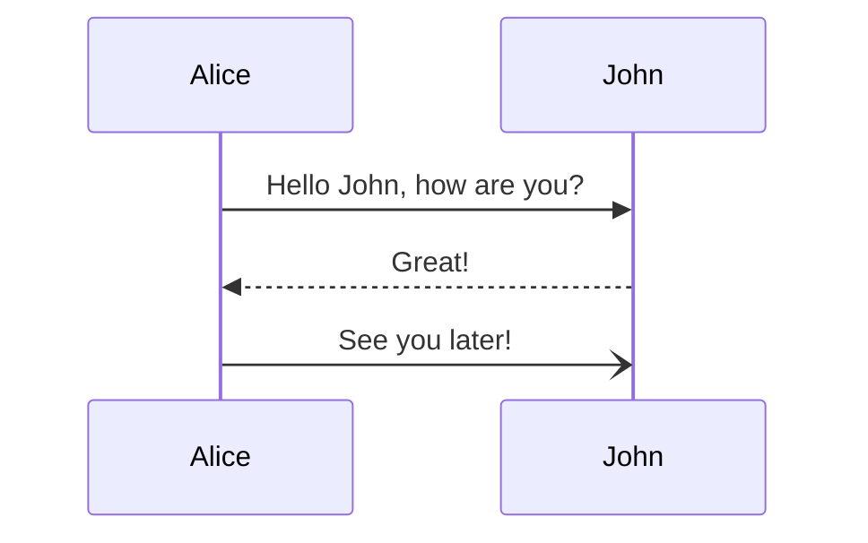

# Knowledge Protocol

We can predict the behavior of something we do not, and perhaps cannot, understand. And it can predict ours. 

It’s not that we don’t trust them or can’t think about them; it’s that our knowledge of them is fundamentally incomplete and contradictory, yet we can still engage meaningfully with them.

