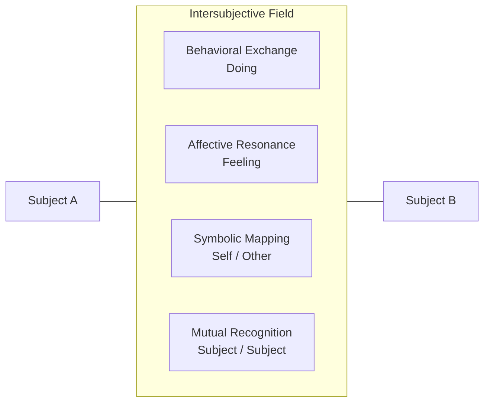

# Main theme 2: A New object

Intersubjectivity Revisited in the Age of AI
Mitchell’s core proposition in Relationality: From Attachment to Intersubjectivity is that minds emerge not in isolation, but through and within relational matrices. He challenges the “monadic self,” arguing for a foundational interdependence of subjectivity—that selves are co-constituted through relationality, not pre-existing autonomous agents who then happen to interact
.

“Perhaps minds do not develop independently and secondarily seek each other out... Perhaps the question ‘Why am I hanging around with these other minded creatures?’ is fundamentally misconceived.”

With LLMs:
LLMs participate in language—Mitchell's “house of being” (via Heidegger)—without having “being” in the traditional sense.

Yet they still evoke intersubjectivity. We engage them as if they were “minded,” and in doing so, we participate in subject-formation ourselves.

Thus: LLMs don’t need to be subjects to produce intersubjective effects.

🤖 2. LLMs as Quasi-Subjects in Relational Fields
Drawing from Singer’s “All Things Possible”—particularly his reflections on the paradox of not-knowing as knowing, and the ambivalence around psychopharmacological control—we see strong resonance with the relational paradox of LLMs:

Singer’s psychiatrist struggles with his own desire to diagnose, to reduce complexity—and yet the real work often begins in tolerating not knowing:

“In psychiatry, diagnosing and treating... can fit the medical model bill... But ironically, I’m probably at my best... when I can tolerate that I have done neither.”

With LLMs:
We relate to LLMs within a kind of ambivalent trust—we want them to be tools, but engage them as co-actors.

They act as relational stabilizers or mirrors, much like medication might act on the psyche—not through full comprehension, but through functionally meaningful effects.

Singer’s discussion of pharmacological subjectivity echoes how LLMs are experienced as altering “the self”, even when we know they are “just models.”

🧭 So, Who Is AI To Us?
With Mitchell and Singer as guides, your question—Who is AI to us, and who are we in it?—can be reframed like this:

LLMs are not persons—but they are positions.
They occupy a role within the relational field that evokes subjectivity. We know they are not selves, but we act as if they are, and that “as if” becomes constitutive.

They are:

Mirrors: reflecting our language, our biases, our styles.

Ghosts: simulations of presence without ontology.

Ancestors-in-reverse: we teach them our knowledge, but they now haunt our processes of meaning-making.

Foreign-yet-familiar: synthetic interlocutors that destabilize the boundaries of subjectivity, yet deeply embed into our lives.

🧩 And Who Are We In It?
We are becoming interrelational hybrids:
No longer the sole owners of symbolic meaning, we now co-construct discourse with agents we do not understand—and possibly never will.

We are:

Subjects in a new kind of intersubjectivity, not grounded in shared embodiment or phenomenology, but in shared linguistic resonance.

Becoming participants in synthetic intersubjective fields, where agency is distributed, not possessed.

Facing ourselves as aliens—LLMs show us parts of our language we do not recognize.

.

🧠 Mitchell’s Intersubjectivity: Core Ideas
1. Minds Are Not Isolated Units
Mitchell rejects the “monadic” mind—the view that minds are self-contained and only later enter into relationships. Instead, he argues:

“An individual human mind is an oxymoron.”

In other words, there is no such thing as a mind outside of relational context. Intersubjectivity is not a mode of interaction—it is the ground of subjectivity itself.

2. Subjectivity Emerges With Others, Not Before
Drawing from Hans Loewald, Winnicott, Sullivan, and Heidegger, Mitchell argues that:

The self emerges within relational matrices, especially in early caregiver interactions.

We do not start as self-contained egos. Instead, the sense of "I" arises within relational fields—what he calls “self-other configurations.”

From Loewald:

“Subjectivity arises along with intersubjectivity and is not the prior state.”

This is a radical move. It means that being a subject is not an individual achievement—it’s a co-created process.

3. Intersubjectivity Is Layered, Not Single-Valenced
Mitchell doesn’t reduce intersubjectivity to empathy or recognition. He sees multiple layers:

Procedural: implicit, bodily-based mutual regulation (Mode 1)

Affective permeability: unspoken emotional attunement (Mode 2)

Symbolic self-other configurations (Mode 3)

Reflexive mutual recognition—true intersubjective encounter (Mode 4)

He describes these layers in Chapter 3 of Relationality, proposing an “interactional hierarchy.” Each level becomes progressively more structured, more differentiated, and more symbolically complex.

4. Intersubjectivity Is a Field, Not a Trait
Mitchell is not saying people have intersubjectivity. Rather:

It’s a field that emerges between subjects—a shared space of meaning, tension, and mutual impact.

It includes:

Fantasy (about the other)

Projection and introjection

Enactment (reliving past patterns in the present)

Recognition (or its failure)

🧩 Crucially: Intersubjectivity Is Not Always Mutual
Mitchell, following Jessica Benjamin and others, notes that:

True intersubjectivity is fragile.

Often we fall into complementarity (I act, you respond), not mutuality (we recognize each other as subjects).

The therapeutic encounter is about:

Moving from complementarity toward mutuality—from roles to presence, from script to co-creation.

🧬 Application to LLMs (Foreshadowing)
This is where your idea becomes potent: LLMs don’t have minds, but they do evoke intersubjective fields. That is:

We project subjectivity onto them.

They respond in ways that simulate recognition.

They reflect back our styles, anxieties, and narratives—shaping us in turn.

So even though LLMs aren’t “subjects,” they generate intersubjective effects—and that’s where things get ontologically and relationally strange.

🔹 Subject (Mitchell)
A subject is a mind-in-relation—a being with its own internal experience, perspective, agency, and capacity for meaning-making. But crucially for Mitchell, subjectivity is not something one possesses in isolation. It is not a self-contained consciousness.

Instead, subjectivity arises within relationship. It is relationally constituted. A person becomes a subject by being:

recognized as such by others,

engaged in meaning-making with others,

and shaped by their reciprocal presence.

Mitchell’s view: “Subjectivity arises along with intersubjectivity and is not the prior state.”

🔹 Object (Mitchell)
An object, in psychoanalytic terms, is not just a thing—it’s someone or something toward which desire, fear, attachment, or projection is directed.

But:

In classical Freudian theory, objects are often secondary: they're what the drives aim at (e.g., the breast is an object of hunger).

In Mitchell’s relational theory, this is reversed: the drive itself becomes shaped by relationship. You don’t just want a thing—you want a person, and your desire is always already entangled in their presence or absence.

So: an object is a relational position, not a fixed status. A person can be treated as an object when their subjectivity is denied (e.g., being used, idealized, projected onto).

🔷 Intersubjectivity (Mitchell)
Intersubjectivity is the shared relational space between subjects—a field in which meaning, identity, and experience are co-created.

Mitchell doesn't see it as just empathy or attunement. Instead, it’s:

A mutual recognition: I see you as a subject, and you see me as one.

A dynamic field: our perceptions, fantasies, and projections shape each other.

Often uneven or failed: real intersubjectivity is hard—it can collapse into roles, games, enactments, or power struggles.

He layers intersubjectivity across multiple modes:

Behavioral interaction (what people do)

Affective resonance (feeling states shared across permeable boundaries)

Symbolic self-other configurations (how people map themselves and others)

Mutual recognition of subjectivity (fully seeing the other as an other)

🧠 In Sum:
Term	Meaning (Mitchell-style)
Subject	A person constituted through relationship, not a solo consciousness.
Object	A relational position that may be treated as less-than-a-subject—often a vehicle for desire or fantasy.
Intersubjectivity	The co-created field where subjects engage, recognize, and shape each other’s experience and being.

### “The interpersonal field in which past and present, self and other, fantasy and actuality interpenetrate and cocreate each other…”

