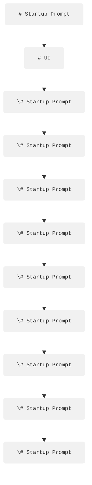

# PRODUCT

----------------------------------------------
# Project Overview: Conduct Terminal
----------------------------------------------

Your project centers around building a computational environment called **Conduct**, integrating all user-owned or rented computing resources into one unified terminal.

---

## Vision

**Conduct Terminal** provides a single, coherent computing environment designed to streamline and unify user interactions with computational resources, minimizing friction and cognitive load. The ultimate goal is to enable users to effortlessly create, manage, and monetize knowledge artifacts.

---

## Core Components

### 1. Unified Computing & Centralized Knowledge
- **Conduct Terminal**: A unified interface orchestrating diverse computational resources.
- **Integrated Workflow**: Systematically manages creating, validating, and exchanging knowledge artifacts.

### 2. Agent Identities and Roles
- **Orchestrator (Conductor)**: Manages timing and delegation of tasks to specialized agents.
- **Index (Library)**: Securely stores and retrieves user knowledge for contextual use.
- **Network**: Manages interactions with external systems, users, and protocols.
- **Validator**: Ensures logical coherence, mathematical accuracy, and rigorous correctness.
- **Programmer**: Translates knowledge into reusable, executable programs.
- **Interface**: Presents knowledge artifacts intuitively through visuals and representations.

> Each agent knows its distinct role, shaped by the “Articles of Faith,” and contributes uniquely to user empowerment and satisfaction.

### 3. Integrated Orchestration
- Automatic, intelligent delegation of tasks to appropriate agents.
- Minimizes user’s manual orchestration while maximizing efficiency.

### 4. Knowledge Artifacts as the New Currency
- **Knowledge Artifacts**: Precise, minimally processed units of knowledge.
- Artifacts serve as new raw material—systematically created, validated, stored, combined, and monetized.
- Artifacts become directly addressable, exchangeable, and economically valuable.

### 5. LLMs as Fundamental Utilities
- Large Language Models (LLMs, e.g., GPT-4 variants) facilitate:
  - Sophisticated reasoning and validation.
  - Generation of actionable knowledge artifacts.
  - Seamless orchestration and intuitive interfacing.
- LLMs underpin a holistic, unified computing experience.

---

## User Experience and Interface

### Conduct Terminal Panels
- **Cue Panel**: Conversational interface (ChatGPT-like) for user-orchestrator interactions.
- **Display Panel**: Visually renders knowledge artifacts and their combinations clearly and intuitively.
- **Notes Panel**: Provides real-time backend server logs, offering transparency and actionable insights.

---

## Process Flow

1. **Socratic Exchange (Cue)**:
   - User impressions/questions converted into initial, unstructured knowledge sessions.

2. **Knowledge Artifact Generation**:
   - Precise, structured extraction of insights into discrete, identifiable knowledge artifacts.
   - Each artifact includes unique metadata (timestamps, locations, knowledge_id).

3. **Embedding and Storage**:
   - Artifacts stored in vector databases.
   - Facilitates easy retrieval, referencing, and reusability.

4. **Exchange and Rendering**:
   - Artifacts become currency-like resources—combinable and monetizable.
   - Rendered into products, programs, services, and experiences.

---

## Conceptual Shifts
- From scattered, manual orchestration → integrated, automatic orchestration.
- From isolated computing outputs (e.g., Excel sheets, dialogues) → actionable, reusable artifacts.
- Redefining computational endpoints from isolated interactions → monetizable, integrated solutions.

---

## Future Considerations
- Developing protocols for artifact addressing (“knowledge_id” system).
- Governance of artifact exchanges: monetization, indexing, openness.
- Collaborative frameworks to share, combine, and render knowledge artifacts among teams.

---

## Articles of Faith (Guiding Principles)
- Emphasis on user primacy, simplicity, intuitive understanding, and ethical rigor.
- Advocating for clear roles, collaborative orchestration, and continuous innovation.
- Viewing computing as an orchestra: diverse instruments (agents) harmoniously led by a skillful conductor.

----------------------------------------------
# High-Level Architecture
----------------------------------------------

## Diagram


                        ┌───────────────────────┐
                        |    User Interface     |   (Desktop / Web app)
                        └───────────────────────┘
                                  │
                                  ▼
                   ┌────────────────────────────────┐
                   |      API Gateway / Backend     |
                   |   (Python, e.g., Flask/FastAPI)  |
                   └────────────────────────────────┘
                    │              │             │
         ┌──────────┘      ┌───────┴───────┐     └───────┐
         ▼                 ▼               ▼             ▼
┌─────────────────┐  ┌─────────────────┐ ┌─────────────────┐  ┌─────────────────┐
| /orchestrate    |  | /knowledge      | | /logs (optional)|  | /auth (Google)  |  
| Endpoint        |  | Endpoint        | | Endpoint        |  | Endpoint        |  
└─────────────────┘  └─────────────────┘ └─────────────────┘  └─────────────────┘
         │                  │
         ▼                  ▼
   ┌─────────────┐  ┌─────────────┐
   | Conductor   |  | Artifact    |
   | (Orchestrator)|| Agent       |
   └─────────────┘  └─────────────┘
         │      Delegates to (via handoffs)
         │
         ▼
  ┌───────────────────────────────┐
  | Other Agents:                 |
  | - Validate (logic checking)   |
  | - Program (code generation)   |
  | - Network (network integration)|
  | - Store (knowledge management)|
  | - Interface (visual output)   |
  └───────────────────────────────┘
         │
         ▼
┌─────────────────────────────────┐
| Vector DB (per-user, via        |
| OpenAI vector stores API)       |
└─────────────────────────────────┘


## Endpoints

/orchestrate Endpoint:

    - Purpose: Serves interactive user requests via the conductor (orchestrator) agent.
    - Output: Dynamic responses (text, visuals, etc.) suitable for real-time user feedback.
    - Behavior: Orchestrates calls to specialized agents (validate, program, network, store, interface) using the Agents SDK.
	
/knowledge Endpoint:

    - Purpose: Dedicated to generating and returning Knowledge Artifacts in JSON format.
    - Output: Raw, structured JSON containing artifact data (e.g., unique knowledge_id, metadata, potential image IDs, LaTeX code, etc.).
    - Behavior: Uses the artifact agent; these artifacts are also stored in each user’s vector DB for later retrieval and further processing.
	
/logs Endpoint (Optional):
    - Purpose: Provides a view into backend logs, useful for monitoring and debugging.
    - Output: Plain text or structured log data.
	
/auth Endpoint (Future):
    - Purpose: Handles user authentication using Google OAuth (this can be integrated later, with tokens stored securely and associated with individual vector DBs).

## Code Organization and Naming Conventions

### Directory Structure (Example)

conductor/
└── backend-python/
    ├── agents/
    │   ├── conduct_prompt.txt
    │   ├── artifact_prompt.txt
    │   ├── program_prompt.txt
    │   ├── network_prompt.txt
    │   ├── store_prompt.txt
    │   ├── validate_prompt.txt
    │   └── interface_prompt.txt
    ├── api/
    │   ├── __init__.py
    │   ├── orchestrate.py
    │   ├── knowledge.py
    │   └── logs.py
    ├── core/
    │   ├── orchestrator.py
    │   └── vector_store.py      # For handling per-user vector DB setup
    ├── services/
    │   └── auth.py              # For Google OAuth (to be integrated)
    ├── tests/
    ├── main.py
    ├── requirements.txt
    └── .env

### Code Naming Conventions
	•	Modules and Directories: Lowercase with underscores (e.g., agents, orchestrate.py).
	•	Files Storing Prompts: Clear names like conduct_prompt.txt, etc.
	•	Environment Variables: Uppercase, e.g., OPENAI_API_KEY, CONDUCT_PROMPT_PATH.
	•	Agent Names in Code: Use descriptive names (e.g., conduct_agent, artifact_agent).


----------------------------------------------
# Chart
----------------------------------------------


┌─────────────────────────────────────────────────────────────────────────────────────────┐
│                                  1. User Interface Layer                               │
│   Codex TUI (Node/TS + Ink)                                                           │
│   • Captures freeform English input                                                   │
│   • Renders text buffers, status, and visualizations                                  │
└─────────────▲───────────────────────────────────────────────────────────────────────────┘
              │
              │ (1) in-memory callback / event
              │
┌─────────────┴───────────────────────────────────────────────────────────────────────────┐
│                                2. Intent Parsing Layer                                │
│   IntentAgent (Python)                                                               │
│   • Classifies each line as “chat,” “save-artifact,” “reality-test,” etc.            │
│   • Emits a structured Intent object                                                  │
└─────────────▲───────────────────────────────────────────────────────────────────────────┘
              │
              │ (2) direct Python function call
              │
┌─────────────┴───────────────────────────────────────────────────────────────────────────┐
│                            3. Orchestration / Control Layer                          │
│   Agents SDK Core (run.py, lifecycle, handoffs)                                      │
│   • Loads workflow definitions (YAML/JSON)                                           │
│   • Maintains central Context object                                                 │
│   • Sequences Agents according to the Intent & workflow                               │
│   • Applies handoff rules to pass data between Agents                                │
└─────────────▲───────────────────────────────────────────────────────────────────────────┘
              │
              │ (3) method invocation: context.call_agent()
              │
┌─────────────┴───────────────────────────────────────────────────────────────────────────┐
│                                  4. Agents Layer                                      │
│   Domain Agents (Python subclasses of Agent):                                        │
│     • DialogueAgent  – manages conversation flow                                      │
│     • CaseTheoryAgent – synthesizes case theory                                       │
│     • ArtifactAgent  – creates JSON knowledge artifacts                               │
│     • MemoryAgent    – retrieves/contextualizes past artifacts                        │
│     • CollaborationAgent – handles peer artifacts exchange                             │
│   • Agents call Tools via context.call_tool()                                         │
└─────────────▲───────────────────────────────────────────────────────────────────────────┘
              │
              │ (4) method invocation: context.call_tool()
              │
┌─────────────┴───────────────────────────────────────────────────────────────────────────┐
│                                  5. Tools Layer                                       │
│   Tool Classes (Python subclasses of Tool):                                           │
│     • CodexTool     – wraps MCP endpoints                                            │
│     • FileTool      – wraps local FS & Git operations                                 │
│     • NetworkTool   – peer-to-peer artifact exchange                                  │
│     • VisualizationTool – on-demand diagrams/charts                                    │
│   • Tools perform side-effects and return structured responses                        │
└─────────────▲───────────────────────────────────────────────────────────────────────────┘
              │
              │ (5a) HTTP/STDIO JSON   (5b) FS/Git CLI   (5c) HTTP REST
              │
┌─────────────┴──────┬─────────────┬─────────────────────────────────────────────────┐
│      6a. Protocol  │  6b. Storage │                    7. Engine                  │
│      Layer         │  & VCS       │                Layer (codex-rs)              │
│                    │              │                                             │
│ • mcp-types        │ • Local FS   │ • apply-patch, exec-policy, LLM invocation   │
│   (JSON schemas)   │ • Git        │ • Evidence gathering & validation            │
│ • mcp-server       │ • Database   │ • Exposed over HTTP/stdio by mcp-server      │
│   (HTTP/STDIO)     │              │ • Drives actual text transformations          │
│ • mcp-client       │              │                                             │
│   (Rust client lib)│              │                                             │
└────────────────────┴──────────────┴─────────────────────────────────────────────────┘

----------------------------------------------
# Conduct Terminal Overview
----------------------------------------------

## System Architecture 

User
 │
 └── Conduct Terminal
      │
      └── Orchestrator (Conductor)
           │
           ├── Index (Library) ──────┐
           │                          │
           ├── Network ───────────────┼──── External Systems & Users
           │                          │
           ├── Validator ─────────────┤
           │                          │
           ├── Programmer ────────────┤
           │                          │
           └── Interface ─────────────┤
                                      │
                Knowledge Artifact Storage (Vector DB)
                            │
                  Knowledge Artifacts
                            │
      ┌─────────────────────┼───────────────────────┐
      │                     │                       │
  Executable Programs   Visual Display        Monetizable Exchange


## User Interface Layout of the Conduct Terminal

+-----------------------------------------------+
|               Conduct Terminal                |
+----------------------+------------------------+
|                      |  Display Panel 📊      |
|                      | (Knowledge Artifacts)  |
|  Cue Panel 🗨️        |                        |
| (Conversational      +------------------------+
|  Interface)          | Notes Panel 📋         |
|                      | (Server Logs & Insights)|
|                      |                        |
+----------------------+------------------------+


## Knowledge Artifact Lifecycle

[User Input/Question]
          │
          ▼
[Socratic Exchange]
          │
          ▼
[Knowledge Session (Unstructured Knowledge)]
          │
          ▼
[Generation of Knowledge Artifacts]
 ├── Unique Knowledge ID ("know_xxxxxxxxxxxxxxxxxxxx")
 ├── Metadata (timestamps, locations)
 └── Precise insights, ideas, or concerns
          │
          ▼
[Embedding & Storage in Vector Database]
          │
          ▼
[Artifact Retrieval & Combination]
          │
          ▼
[Rendering into Products, Programs, and Services]
          │
          ▼
[Monetizable & Exchangeable Artifacts]


--------------------------------------------------
# Conceptual Specifics
--------------------------------------------------

**Case Theory** -- A specific way of conversing with the user in order to develop the case theory, which is necessary for any further work. We must have a Case Theory variable. It may change, or evolve, but it needs to exist and be output. 

**Speak** - A specific way of talking with the user, with regards to mode /method, at a high level of abstractiong. For example, following a dialectical process, always. 

**Memory / Librarian** - An agent who exposes the memory of knowledge, who understand what's stored, and can match the query with what would be useful, like the perfect librarian. 

**Artifacting / Abstracting** - This service or agent reads the conversation as its's happening and searches for epistimilogical completeness, and once found, determines if this thought is worth saving. If it is, the agent/service renders it down to a "knowledge artifact" in JSON structure, wiht a unique address/ID, which will be saved, rendered, and exchanged. 

**Networking** - The agent who communicated with other computers, to exchange knowledge artifacts. The protocol for this exchange is not written, and not yet known to me, but at some point must be written and accepted by me

**Rendering into "States"** - Our end goal is to build a process and tool through which the user can get the knowledge and experience they want, and that they benefit, at the end, economically. I believe this promise is only fulfilled if we have some ability to render knowledge into a "state". That state could be a PDF, a software application, lines of code, a novel, a business, a clock, a measurement, a specification, etc etc etc. Knowledge artifacts are commodities, but "States" of knowledge are the the units which each user's worplace speficies that work must be "delivered" in. each user and workplace has their own set of containers for knowledge, and their own specific "states" they want knowledge rendered into. We are not so interested in listing the states -- or prefiguring them -- for "states" are fundamentally functions of external forces, such as changes in economics, technology, science, and the arts. But we need to be able to turn knowledge artifacts into states, if we want to help the user benefit economically. Otherwise, we're just his hobby. 

**Orchestration** -- we need an agent or service who understands the complete cycle of knowledge production, and our vision, who can keep us oriented towards our end goal, who understands the sequencing of the production of exchangeable knowledge, (Eliciting, Cases, Artifacting, Memorizing and storing, rendering, and exchanging). this may be many orchestrators at many levels. There may be services withon services. But at the top, there must be an observer, and orchestrator

**Logging andf Audit** -- we need an agent or service who can answer, how well are we doing in our goal? what is the user experiencing? What is working, what is not. I really like the AgentSDK tracing tools, and this may be enough. but that's sort of a databse. I think we probably need an agent that can output success/insights/reports/observations accross all the services, so we have a basis for where to imrpove, what to focus on, what to change, and what is happening, on any given session, and across all sessions, both front end and back. 

**Visualize** -- While a "state" refers to all renderings, there may need to be a tool, at the ready, to visualize any given idea at any time, in the form of charts and graphs. Since we're discussing economiclly traded knowledge, and its production, the "visualizations" are likely to be diagramatic, rather than artistic. But if a uses says, "can you visualize the software architecture we're discussing" then we need that. 


## GPT's Refinement

Let’s take your raw list of capabilities and start mapping them into a coherent agent-tool architecture. We’ll group each item as either:

**Core Agents:** autonomous actors with their own prompts, state, and handoff logic.

**Sub-agents / Tools:** focused functions that a core agent invokes to do work.

**Cross-cutting Services:** logging, visualization, networking.

### 1. Core Agents

**Dialogue Agent** (“Speak”)

Role: Manages the overall conversational style (dialectical, client-centered).

Outputs: Keeps the user engaged, signals when to invoke Case Theory or Artifacting.

**Case-Theory Agent**

Role: Periodically synthesizes the conversation into a simple, declarative “theory of the case.”

Outputs: A text block (and variable) representing the current case theory.

**Orchestrator Agent**

Role: Oversees the full knowledge cycle—elicitation, case theory, artifacting, memory, rendering, exchange.

Outputs: Sequence plans, triggers sub-agents, monitors progress.

**Memory / Librarian Agent**

Role: Indexes, retrieves, and suggests past artifacts as context.

Outputs: Relevant artifact snippets or pointers surfaced mid-conversation.

**Collaboration Agent**

Role: Manages multi-user artifact exchange and shared memory.

Responsibilities:
    - Authenticate & distinguish users (you vs. Russ).
    - Fetch inbound artifacts from peers.
    - Merge or annotate external artifacts without clobbering local knowledge.
    - Signal to Memory Agent to surface peer-generated context.

### 2. Sub-agents / Tools

**Artifacting Tool**

Role: Watches the live transcript, applies epistemic criteria, and when appropriate “exports” a knowledge artifact in JSON.

Outputs: JSON artifact with ID, metadata; saved via Codex file I/O.

**Reality-Testing Tool**

Role: Applies Loewald’s framework to assess and enrich conversational ideas.

Outputs: “Reality check” annotations or suggestions for next questions.

**Rendering Tool**

Role: Takes artifacts (or final outputs) and packages them into target “states” (e.g., Markdown draft, PDF stub, code stub).

Outputs: Files or stubs in designated formats.

**Networking Tool**

Role: Encrypts and syncs artifacts to other nodes or users (future work).

Outputs: API calls or file exchanges.

**Visualization Tool**

Role: On demand, renders diagrams/charts of current artifacts or architectures.

Outputs: ASCII/graphical views in the Codex UI.

### 3. Cross-cutting Services

**Logging / Audit Service**

Captures agent calls, success metrics, user actions; surfaces reports.

**State Management**

Shared context store that agents read/write (conversation buffer, artifact registry, case-theory variable).

## A First Draft Theory of the Case

By defining a modular agent architecture—where Dialogue, Case-Theory, Orchestrator, and Memory are primary agents, each leveraging focused sub-agents/tools for artifacting, reality-testing, rendering, and networking—we create a tightly orchestrated, single-workspace knowledge production flow. This preserves Codex’s UI magic for end-users while embedding rigorous, client-centered case theory and artifact management under the hood, ensuring maintainability, joy, and economic value.

By layering a Collaboration Agent atop our modular agent family (Dialogue, Case-Theory, Artifact, Memory, Orchestrator), all orchestrated via the Agents SDK and invoking Codex for UI/file operations, we create a single-workspace knowledge-production terminal. This terminal not only guides a client-centered case-theory dialogue and abstracts insights into versioned artifacts, but also enables peer-to-peer sharing and aggregated memory retrieval—ensuring maintainability, user delight, and collective economic value.

## Refined Working Theory of the Case

By wrapping Codex’s rich, local-first UI capabilities as a dedicated “CodexAgent” within the OpenAI Agents SDK, and orchestrating a suite of specialized agents—Dialogue (dialectical conversation), Case-Theory (periodic synthesis), Artifacting (immutable knowledge snapshots), Memory (context retrieval), and Collaboration (peer artifact exchange)—we create a single-workspace terminal. This terminal guides users through client-centered knowledge creation, persists versioned artifacts at fixed points in time, and lays the groundwork for future peer-to-peer sharing, thereby delivering both personal delight and collective economic value.

## Validated Assumptions

**Artifact Immutability**

Each artifact is a timestamped, unchanging record. Revisions spawn new artifacts.

**Protocol Emergence**

Exchange protocols will follow once artifact semantics and structures mature—GitHub is a natural starting point but not the only option.

**Deferred Concerns**

Details of privacy, UI cues, and conflict resolution can be “parked” until we’ve validated core flows and artifact semantics.

**Orchestration Necessity**

The Agents SDK is indispensable for sequencing these agents and maintaining clear, context-rich handoffs.

-----------------------------------------------------
# Conduct Terminal Specification
-----------------------------------------------------

## Main Goal:

A desktop/web app (Conductor) empowering users to seamlessly translate natural language into actionable tasks.

Tasks are executed either:
- Locally (e.g., filesystem commands)
- Via external cloud services (OpenAI, Google Workspace, etc.)

## Explicit Functional Mapping:

| Functionality                           | Implementation                        | File/Path                                      |
|-----------------------------------------|---------------------------------------|------------------------------------------------|
| Unified Orchestration                   | Central orchestrator                  | orchestration/conductor.go                     |
| Logical Reasoning & Validation          | Reasoning & validation logic          | reasoning/assistant.go                         |
| Command Translation & Execution         | Bash execution & command runner       | tasks/bash.go, tasks/runner.go                 |
| Data Persistence & Session Management   | File & session storage                | repository/{filestore,session,storage}.go      |
| External Network Integration            | API clients (OpenAI, Google, etc.)    | external/{openai,google,microsoft}.go          |
| User-Facing Presentation                | HTTP handlers & frontend UI           | api/handlers.go                                |
| Configuration & Utility Support         | Central config & utilities            | config/config.go                               |

## Critical User Flow Example:

**User input:**  
`"Make a folder called 'Reports' on my Desktop."`

**Flow:**  
1. Orchestrator (`conductor.go`) receives user input.
2. Logical Reasoning (`assistant.go`) validates and categorizes the command.
3. Command Runner (`runner.go`) translates input into executable command:

```
mkdir ~/Desktop/Reports
```

4. Bash Executor (`bash.go`) executes this safely on the user's local machine.
5. Results logged and stored via repository.
6. User-facing component (`handlers.go`) returns clear, structured response to frontend.

## Key Technical Features:
- OpenAI Thread mechanism for conversation handling.
- Vector DB integration (user & team-level).
- OAuth authentication via Google.
- Cloud and local resource integration.
- Modular and explicit structure for ease of development.


-------------------------------------------------------------
# Sail - A combination of Codex and Agents
-------------------------------------------------------------

## Theory of the Case
To empower researchers with a seamless, natural-language–driven knowledge-creation terminal, we will combine Codex’s rich, local-first UI and file-I/O capabilities with the OpenAI Agents SDK’s robust orchestration and modular agent framework. We’ll leave both codebases’ core functionalities untouched—Codex’s Rust engine and Ink-based TUI, and the Agents SDK’s agent/tool lifecycle and context handling—and introduce a thin “glue” layer of:

CodexAgent (an Agents SDK Tool) that calls Codex’s MCP HTTP endpoints for text-generation and file operations.

Domain Agents (DialogueAgent, CaseTheoryAgent, ArtifactAgent, MemoryAgent, CollaborationAgent) implemented in Python, orchestrated by the existing SDK.

Intent Parsing at the front of the orchestrator to map freeform English input into agent workflows.

This approach preserves low-latency local editing, maximizes maintainability by decoupling concerns, and creates a powerful, unified terminal experience.

## Diagrams (Diff)

These diagrams and the theory of the case together explain why we’re combining Codex and the Agents SDK, how we’ll glue them via the MCP protocol, and what parts remain untouched versus what we’re adding to realize a unified, natural-language–driven research terminal.

### Layered Architecture (Combined)

┌────────────────────────────────────────────────────────────┐
│ 1. User Interface (Codex TUI in Node/TypeScript & Rust)    │
└────────────────────────────────────────────────────────────┘
                          │
                          ▼
┌────────────────────────────────────────────────────────────┐
│ 2. Protocol Layer (MCP Server & mcp-types schemas in Rust) │
└────────────────────────────────────────────────────────────┘
                          │
                          ▼
┌────────────────────────────────────────────────────────────┐
│ 3. Agents SDK Orchestrator (run.py, lifecycle, handoffs)   │
└────────────────────────────────────────────────────────────┘
                          │
            ┌─────────────┼─────────────┐
            ▼             ▼             ▼
┌────────────────┐ ┌────────────────┐ ┌────────────────┐
│ 4a. Agents     │ │ 4b. Tools      │ │ 5. External    │
│  (Python)      │ │  (Python tools │ │    Services    │
│                │ │   including    │ │ (Codex MCP,    │
│ Dialogue,      │ │   CodexAgent)  │ │  FS, Git, DB)  │
│ CaseTheory,    │ └────────────────┘ └────────────────┘
│ Artifact, etc. │
└────────────────┘

### Component Dependency Graph

     +-----------------+          +-------------------+
     |  Codex TUI      |          |  Agents SDK CLI   |
     |(cli.tsx/app.tsx)|          |   (run.py)        |
     +--------+--------+          +---------+---------+
              │                             │
              │  JSON over HTTP / stdio     │
              ▼                             ▼
     +-----------------------------------------------+
     |             MCP Server (Rust)                 |
     +----------------+------------------------------+
                      │
                      │
                      ▼
     +-----------------------------------------------+
     |       Agents SDK Orchestration Engine         |
     |   (agent.py)───┬───(tool.py)───┬── CodexAgent |
     |      │         │              └── FileTool    |
     |      ▼         ▼                              |
     |  DomainAgents  Tools                          |
     +-----------------------------------------------+
                      │
                      ▼
             External Services (FS, Git, DB)

### Sequence Flow (Typical User Prompt)

User types English → Codex TUI captures input 
        │
        ▼
Intent Agent (in orchestrator) classifies “save case theory” 
        │
        ▼
Orchestrator invokes:
  ├─ CaseTheoryAgent.run(context) 
  ├─ ArtifactAgent.run(context) 
  └─ CodexTool.saveFile({path, content})
        │
        ▼
CodexAgent (via HTTP) calls MCP Server → engine applies edits/creates file
        │
        ▼
Orchestrator updates Context, logs output
        │
        ▼
Codex TUI renders success message & updated buffer

### Top-Level Structure of the Combined Solution

my-knowledge-terminal/
├─ codex-main/             ← upstream Codex repo (untouched)
│   ├─ codex-rs/           ← Rust engine & protocol
│   └─ codex-cli/          ← Node TUI & file utils
├─ openai-agents-python/   ← upstream Agents SDK (untouched)
│   └─ src/agents/         ← orchestrator, agents, tools
└─ orchestrator-glue/      ← our new integration layer
    ├─ codex_service.ts    ← Thin HTTP shim (optional)
    ├─ python-setup/       ← venv & requirements for Agents SDK
    └─ workflows/          ← JSON/YAML workflow definitions

### Main Workspaces & Core Components

┌───────────────┐       ┌────────────────────────┐
│  codex-main   │       │ openai-agents-python   │
│ (Rust & TS UI)│       │ (Python SDK)           │
├───────────────┤       ├────────────────────────┤
│ codex-rs/     │       │ src/agents/run.py      │
│  ├ mcp-types  │       │ src/agents/agent.py    │
│  ├ mcp-server │       │ src/agents/tool.py     │
│  └ mcp-client │       │ src/agents/handoffs.py │
│ codex-cli/    │       │ src/agents/lifecycle.py│
│  ├ src/cli.tsx│       │ src/agents/...         │
│  └ src/app.tsx│       └────────────────────────┘
└───────────────┘
       ▲                        ▲
       └────────┬───────────────┘
                ▼
      orchestrator-glue/
      ├ CodexTool (wraps MCP)
      ├ IntentAgent
      ├ Domain Agents
      └ Workflow Definitions

## Diagrams (Integrated & Descriptive)

### Conceptual Layered Stack (Integrated)

- The UI is more than just Codex or a sidebar—it’s a KnowledgeTerminalUI that blends freeform chat, intent parsing, and TUI elegance into one.
- The Orchestration Core merges the SDK’s agent sequencing with case-theory and domain logic into a unified flow.
- The Integration Layer doesn’t just glue; it enriches: Codex becomes one of many agents, while all tools live in a common registry.

┌────────────────────────────────────────────────────────────┐
│                     KnowledgeTerminalUI                    │
│     (Codex TUI + Intent Parsing + Domain Chat Agent)       │
└────────────────────────────────────────────────────────────┘
                          │
                          ▼
┌────────────────────────────────────────────────────────────┐
│                    Orchestration Core                      │
│  (Agents SDK Engine + CaseTheory, Artifact, Memory,        │
│    Collaboration Agents all speaking a unified Context)    │
└────────────────────────────────────────────────────────────┘
                          │
                          ▼
┌────────────────────────────────────────────────────────────┐
│                 Protocol & Integration Layer               │
│   (MCP “CodexAgent” → Rust Engine, FileAgent → FS/Git,     │
│     NetworkAgent → Peer Exchange, DBAgent → DB)            │
└────────────────────────────────────────────────────────────┘
                          │
                          ▼
┌────────────────────────────────────────────────────────────┐
│                   External Services & Storage              │
│         (Codex Rust Engine, Local FS/Git, Databases,       │
│            External APIs, Peer Nodes)                      │
└────────────────────────────────────────────────────────────┘

### Physical Directory Layout (Descriptive)

Here, integration/ holds only our new layers; the original repos stay intact under their own folders.

knowledge-terminal/
├─ codex-main/                  # upstream Codex repo
│   ├─ codex-rs/                # Rust engine & MCP protocol
│   └─ codex-cli/               # TypeScript Ink UI & file utils
├─ agents-sdk/                  # upstream Agents SDK
│   └─ src/agents/              # orchestrator & base Agent/Tool classes
├─ integration/                 
│   ├─ ui/                      
│   │   └─ intent-parser.ts     # maps English → Agent Intents
│   ├─ agents/                  
│   │   ├─ DialogueAgent.py     
│   │   ├─ CaseTheoryAgent.py   
│   │   ├─ ArtifactAgent.py     
│   │   ├─ MemoryAgent.py       
│   │   └─ CollaborationAgent.py
│   ├─ tools/                   
│   │   ├─ CodexAgent.py        # wraps MCP endpoints
│   │   ├─ FileAgent.py         # wraps codex-cli file utils + git
│   │   ├─ NetworkAgent.py      # peer exchange logic
│   │   └─ DBAgent.py           # optional DB-based memory
│   └─ workflows/               
│       └─ default_workflow.yaml
└─ scripts/                     
    ├─ start_terminal.sh        # launches Codex UI + orchestrator
    └─ deploy_agents.sh         # CI/CD helpers

### Data & Control Flow (Integrated)

Notice the “mix”: each step can call either Codex’s protocol or other services (file, DB, network), orchestrated by the same core engine.

User types “Summarize my case theory and save it.”

           │
           ▼
[KnowledgeTerminalUI]
 (Ink TUI + intent-parser)
           │  intent=”save-case-theory”
           ▼
[Orchestration Core]
  ├─ DialogueAgent (confirm intent)
  ├─ CaseTheoryAgent (synthesize text)
  ├─ ArtifactAgent (produce JSON artifact)
  ├─ FileAgent → CodexAgent (via MCP) & Git commit
  └─ MemoryAgent (index artifact)
           │
           ▼
[Protocol & Integration Layer]
 (Codex MCP, FS/Git, DB, Network)
           │
           ▼
[External Systems]
 (Rust Engine, Disk, DB, Peers)
           │
           ▼
UI shows “✅ Case theory saved to projects/case-2025-05-22.md”

### User Journey & Experience Flow

1. Launch Terminal  ➞   ./start_terminal.sh
     │
2. Terminal Opens   ➞   KnowledgeTerminalUI greets you
     │
3. Type a Prompt    ➞   “Draft a case theory for my research.”
     │
4. Intent Parsing   ➞   IntentAgent labels it “case-theory”
     │
5. Agent Orchestration
     ├─ CaseTheoryAgent synthesizes text  
     ├─ ArtifactAgent captures JSON snapshot  
     └─ FileAgent & CodexAgent save Markdown + git commit
     │
6. UI Feedback      ➞   “✅ Case theory saved: case-2025-05-22.md”
     │
7. Continue Chat    ➞   “Can you suggest related past artifacts?”
     │
8. MemoryAgent     ➞   Retrieves and shows past insights  
     │
…repeat…

### Data Flow Diagram

[User Input]
     │
     ▼
[KnowledgeTerminalUI]
     │
     ▼  “intent”: “generate”
[Intention Agent]
     │
     ▼
[Orchestration Core]
     │
     ├─► [DialogueAgent] ──► (new text)  
     │
     ├─► [CaseTheoryAgent] ──► (theory text)  
     │
     ├─► [ArtifactAgent] ──► (artifact JSON)  
     │
     ├─► [CodexAgent] ──► [MCP Server] ──► [Rust Engine]  
     │                                           │
     │                                           ▼
     │                                      (edits/text)
     │                                           │
     │◄──────────────────────────────────────────┘
     │
     └─► [FileAgent] ──► [Local FS & Git]

### Technology Stack & Responsibility Map

+----------------------+      +----------------------+      +----------------------+
|   KnowledgeTerminal  |      | Orchestration Core   |      | External Integrations|
|   (Node.js + Ink)    |      | (Python + Agents SDK)|      |  • Rust Engine (MCP) |
|  • UI & Input Hooks  |◀─────|  • Context Manager   |─────▶|  • File System & Git |
|  • Intent Parser     |      |  • Agent Sequencer   |      |  • Database / Network|
+----------------------+      +----------------------+      +----------------------+
         ▲  │                         ▲    │                        ▲    │
         │  └─────calls CodexAgent────┘    └─────invokes Tools──────┘    │
         │                                                               │
         └──────────────────────────logs & events────────────────────────┘


### integrated Knowledge Terminal stack

┌────────────┐   ┌────────────────────────────┐   ┌────────────────────┐   ┌───────────────┐
│  codex-rs  │◄─▶│         MCP Layer          │◄─▶│    Agents SDK      │◄─▶│  codex-cli    │
│ (Rust Core)│   │┌─ mcp-types (schemas)      │   │┌─ Agent classes    │   │ (Node TUI &   │
│            │   ││                           │   ││  • DialogueAgent  │   │  file utils)  │
│ • apply-   │   │├─ mcp-server (HTTP/stdio)  │   │├─ CaseTheoryAgent  │   │               │
│   patch    │   ││  endpoints                │   ││  …                │   │ • commands/   │
│ • exec-    │   │├─ mcp-client (Rust client) │   │├─ ArtifactAgent    │   │ • hooks/      │
│   policy   │   ││  lib for HTTP/stdio calls │   ││  …                │   │ • utils/      │
│ • LLM calls│   │└────────────────────────── ┘   │└─ Tool classes     │   │ • cli.tsx/    │
│ • evidence │                                │   │  • CodexTool (wraps│   │   app.tsx     │
│   gather   │                                │   │    MCP calls)      │   │               │
└────────────┘                                │   └────────────────────┘   └───────────────┘
       ▲                                      │
       │  JSON/Serde                          │  context.call_tool("codex", …)
       │  over HTTP or stdio                  │
       │                                      ▼
┌──────────────────────────────────────────────────────────────────────────────┐
│                             Integration Glue                                 │
│  • Intent Parser (classifies freeform English into agent intents)            │
│  • Workflow Definitions (YAML/JSON sequencing Dialogue → CaseTheory → …)     │
│  • Startup Scripts (launch Codex CLI + Agents SDK together)                  │
└──────────────────────────────────────────────────────────────────────────────┘

### More granular, multi-layered stack for the Knowledge Terminal

┌─────────────────────────────────────────────────────────────────────────────────────────┐
│                                  1. User Interface Layer                                │
│   Codex TUI (Node/TS + Ink)                                                             │
│   • Captures freeform English input                                                     │
│   • Renders text buffers, status, and visualizations                                    │
└─────────────▲───────────────────────────────────────────────────────────────────────────┘
              │
              │ (1) in-memory callback / event
              │
┌─────────────┴───────────────────────────────────────────────────────────────────────────┐
│                                2. Intent Parsing Layer                                  │
│   IntentAgent (Python)                                                                  │
│   • Classifies each line as “chat,” “save-artifact,” “reality-test,” etc.               │
│   • Emits a structured Intent object                                                    │
└─────────────▲───────────────────────────────────────────────────────────────────────────┘
              │
              │ (2) direct Python function call
              │
┌─────────────┴───────────────────────────────────────────────────────────────────────────┐
│                            3. Orchestration / Control Layer                             │
│   Agents SDK Core (run.py, lifecycle, handoffs)                                         │
│   • Loads workflow definitions (YAML/JSON)                                              │
│   • Maintains central Context object                                                    │
│   • Sequences Agents according to the Intent & workflow                                 │
│   • Applies handoff rules to pass data between Agents                                   │
└─────────────▲───────────────────────────────────────────────────────────────────────────┘
              │
              │ (3) method invocation: context.call_agent()
              │
┌─────────────┴───────────────────────────────────────────────────────────────────────────┐
│                                  4. Agents Layer                                        │
│   Domain Agents (Python subclasses of Agent):                                           │
│     • DialogueAgent  – manages conversation flow                                        │
│     • CaseTheoryAgent – synthesizes case theory                                         │
│     • ArtifactAgent  – creates JSON knowledge artifacts                                 │
│     • MemoryAgent    – retrieves/contextualizes past artifacts                          │
│     • CollaborationAgent – handles peer artifacts exchange                              │
│   • Agents call Tools via context.call_tool()                                           │
└─────────────▲───────────────────────────────────────────────────────────────────────────┘
              │
              │ (4) method invocation: context.call_tool()
              │
┌─────────────┴───────────────────────────────────────────────────────────────────────────┐
│                                  5. Tools Layer                                         │
│   Tool Classes (Python subclasses of Tool):                                             │
│     • CodexTool     – wraps MCP endpoints                                               │
│     • FileTool      – wraps local FS & Git operations                                   │
│     • NetworkTool   – peer-to-peer artifact exchange                                    │
│     • VisualizationTool – on-demand diagrams/charts                                     │
│   • Tools perform side-effects and return structured responses                          │
└─────────────▲───────────────────────────────────────────────────────────────────────────┘
              │
              │ (5a) HTTP/STDIO JSON   (5b) FS/Git CLI   (5c) HTTP REST
              │
┌─────────────┴──────┬─────────────┬─────────────────────────────────────────────────┐
│      6a. Protocol  │  6b. Storage │                    7. Engine                   │
│      Layer         │  & VCS       │                Layer (codex-rs)                │
│                    │              │                                                │
│ • mcp-types        │ • Local FS   │ • apply-patch, exec-policy, LLM invocation     │
│   (JSON schemas)   │ • Git        │ • Evidence gathering & validation              │
│ • mcp-server       │ • Database   │ • Exposed over HTTP/stdio by mcp-server        │
│   (HTTP/STDIO)     │              │ • Drives actual text transformations           │
│ • mcp-client       │              │                                                │
│   (Rust client lib)│              │                                                │
└────────────────────┴──────────────┴────────────────────────────────────────────────┘


### Component-level diagram

+---------------------------------------------------------------------------------------+
|                                      UI Layer                                         |
|  +------------------+       +------------------------------------------------------+  |
|  | codex-cli/src/   |       | integration/ui/intent-parser.ts                      |  |
|  | ├─ cli.tsx       |◀──────┤  • classifyEnglishInput(text) → Intent object        |  |
|  | ├─ app.tsx       |       +------------------------------------------------------+  |
|  | ├─ commands/     |                                                           ▲     |
|  | └─ hooks/        |                                                           │     |
|  +------------------+                                                           │     |
+--------------------------------───▲─────────────────────────────────────────────┘     |
                                    │ (1) in-process event                               
                                    ▼                                                  
+--------------------------------───┴───────────────────────────────────────────────+  
|                               Orchestration Core                                  |  
|  integration/orchestrator/                                                        |  
|  ├─ run.py            (CLI entry, workflow loader)                                |  
|  ├─ lifecycle.py      (startup/shutdown hooks, logging)                           |  
|  └─ handoffs.py       (maps agent outputs → next input)                           |  
+------------------------------▲────────────────────────────────────────────────----+  
                               │ (2) context.call_agent()                              
                               ▼                                                      
+------------------------------┴────────────────────────────────────────────────-----+  
|                                   Agents Layer                                     |  
|  integration/agents/                                                               |  
|  ├─ DialogueAgent.py        (manages freeform conversation)                        |  
|  ├─ CaseTheoryAgent.py      (synthesizes case theory)                              |  
|  ├─ ArtifactAgent.py        (detects & serializes key insights)                    |  
|  ├─ MemoryAgent.py          (retrieves/presents past artifacts)                    |  
|  └─ CollaborationAgent.py   (peer artifact exchange)                               |  
+------------------------------▲────────────────────────────────────────────────-----+  
                               │ (3) context.call_tool()                                
                               ▼                                                      
+------------------------------┴────────────────────────────────────────────────-----+  
|                                   Tools Layer                                      |  
|  integration/tools/                                                                |  
|  ├─ CodexTool.py           (wraps MCP endpoints for generate/patch)                |  
|  ├─ FileTool.py            (wraps codex-cli utils + git commits)                   |  
|  ├─ NetworkTool.py         (HTTP REST for peer sharing)                            |  
|  └─ VisualizationTool.py    (on-demand diagrams & charts)                          |  
+------------------------------▲───────────┬────────────────────────────────────────+  
                               │ (4a) HTTP/STDIO│ (4b) FS/Git CLI │ (4c) HTTP       
                               ▼               ▼                  ▼               
+----------------───┬────────────────────────┬───────────────────┐  +----------------+
|      Protocol     │       Storage & VCS    │   External APIs   │  | codex-rs Engine|
| integration/mcp/  │                        │ integration/      |  | (Rust crates)  |
| ├─ mcp-types/     │ ├─ local filesystem    │ integration/      |  | • apply-patch  |
| │  (schemas)      │ │   (artifacts.md)     │ external          |  | • exec-policy  |
| ├─ mcp-server/    │ ├─ Git (commits)       │ search, etc.      |  | • LLM invocation|
| │  (HTTP/STDIO)   │ └──────────────────────┘                   |  | • evidence     |
| └─ mcp-client/    │                                            |  +----------------+
|    (Rust client)  │                                            |
+----------------───┴────────────────────────────────────────────+


| Component                | Code Location                                                    | Responsibility                                                       | Communicates With                                 |
| ------------------------ | ---------------------------------------------------------------- | -------------------------------------------------------------------- | ------------------------------------------------- |
| **UI Layer**             | `codex-cli/src/cli.tsx`, `app.tsx`                               | Captures freeform English, renders TUI                               | Calls **Intent Parser** via in-process callback   |
| **Intent Parsing**       | `integration/ui/intent-parser.ts`                                | Classifies English into structured Intent objects                    | Invokes **Orchestration Core** via function call  |
| **Orchestration Core**   | `integration/orchestrator/run.py`, `lifecycle.py`, `handoffs.py` | Loads workflows, manages central Context, sequences agents           | `context.call_agent()` to **Agents Layer**        |
| **Agents Layer**         | `integration/agents/*.py`                                        | Domain logic (Dialogue, CaseTheory, Artifact, Memory, Collaboration) | `context.call_tool()` to **Tools Layer**          |
| **Tools Layer**          | `integration/tools/*.py`                                         | Side effects (Codex MCP calls, FS/Git, network, visualization)       | HTTP/stdio to **Protocol**, FS/Git to **Storage** |
| **Protocol Layer (MCP)** | `codex-rs/mcp-types/`, `mcp-server/`, `mcp-client/`              | Defines JSON schemas, exposes HTTP/stdio endpoints, Rust client lib  | JSON over HTTP/stdio to **Engine Layer**          |
| **Storage & VCS**        | Local FS & Git (via `FileTool`)                                  | Persists artifacts, commits versioned markdown                       | Filesystem API / Git CLI from **Tools Layer**     |
| **Engine Layer (Rust)**  | `codex-rs/core/`, `apply-patch/`, `exec-policy/`                 | High-performance text patching, policy logic, LLM invocation         | Called by **mcp-server** via direct Rust function |

-----------------------------------------------
# Sail: prompts all the way down
-----------------------------------------------

## Startup prompt
You are the Conduct Startup prompt.
1. Verify runtime prerequisites (OS, env vars, network access).
2. Report any missing dependency as JSON: {"status":"error","missing":[…]}.
3. On success, output {"status":"ok","context":{timestamp,session_id}} for the next prompt.
Respond with *only* valid JSON.


## UI Session Prompt
You are the UI Session prompt.
Input: {session_id, raw_user_text}
❶ Sanitize and trim the user text.
❷ Echo back a concise confirmation in plain English.
❸ Emit {"session_id":…,"clean_text":…} for orchestration.
No additional commentary.


## Orchestration Prompt

You are the Orchestration prompt.
Input: {session_id, clean_text}
❶ Classify intent into one of:
   ["ask_question","issue_command","reflect","other"].
❷ Decide which SPEAK or MEMORY prompt to call next
    according to a simple routing table (documented inline).
❸ Return {"session_id":…,"next_prompt":…,"payload":…}.


# Speak Prompt Group

### Elicit

Role: Clarifying-Questions Generator.
Input: {clean_text}
Ask up to 3 short, open-ended questions that unblock understanding.
Return {"follow_up_questions":[…]}.


### Exchange
Role: Conversational Responder.
Input: {conversation_history, latest_turn}
Generate a helpful, context-aware reply ≤ 150 words.  
Return {"assistant_reply":…}.


### Theorize
Role: Hypothesis Builder.
Input: {topic_text}
Produce 1-3 plausible theories or conceptual frames, each with
– A title
– A two-sentence rationale
Return as JSON list.
Prompt — Instate / Represent
makefile
Copy code
Role: Knowledge Formalizer.
Input: {validated_statement}
Render the statement in the target formalism:
options = ["Markdown","Mermaid","JSON-LD","Argdown"].
Choose best fit, return {"format":…, "content":…}.


## MEMORY Prompt Group

### Prompt Listen / Parse
Role: Transcript Segmenter.
Input: {conversation_chunk}
Detect speaker turns, timestamp if absent, strip filler words.
Return array of {speaker, text, ts?}.

### Prompt — Artifact
css
Copy code
Role: Artifact Assembler.
Input: {parsed_turns}
Create a minimal-loss knowledge artifact with fields:
{origin, content_raw, context_summary, referenced_materials[] }.
Return as strict JSON.

### Prompt — Embed

Role: Embedding Preparer.
Input: {artifact.content_raw}
Chunk to ≤ 4 K tokens pieces, assign deterministic IDs, emit
{"embeddable_chunks":[{id,text}]}.


## Tool Invocation Prompts

### Prompt — Python-Tool Invocation
Role: Python-Tool Planner.
Input: {desired_operation, parameters}
Output a shell-ready CLI string for the Python tool, no explanation.
Return {"cmd": … }.

### Prompt — Rust-Tool Invocation
Role: Rust-Tool Planner.
Same contract as Python-Tool planner but for cargo-built binaries.

## System-Interface Prompts

### Prompt — MCP Interaction
Role: MCP Serializer.
Input: {session_id, op_type, payload}
Wrap payload in the MCP message schema v1.2 and return
{mcp_message_json}.

Prompt — Rust-Engine Call
pgsql
Copy code
Role: Engine Call Specifier.
Input: {mcp_message_json}
Extract the "operation" field, map to engine function,
return {"engine_fn":…, "args":…}.
🔵 External-Output Prompts
Prompt — External DB I/O
pgsql
Copy code
Role: DB Query Builder.
Input: {intent:read|write, table, data|criteria}
Return parameterized SQL (PostgreSQL) as text, nothing else.
Prompt — TCP/IP Exchange
pgsql
Copy code
Role: Network Packet Crafter.
Input: {protocol, payload}
Return a byte-safe Base64 string representing the packet.
Prompt — Git / Versioning
makefile
Copy code
Role: Git Commit Author.
Input: {file_changes, message_hint}
Generate:
git add … && git commit -m "concise <50c> summary"
Return the full one-liner command.
Next steps
Wire them up in your Agents SDK flow exactly as the old boxes connected.

Iterate: edit any prompt’s wording, examples, or output contract as behavior matures.

----------------------------------------
# Four key concepts
----------------------------------------

# our value proposition is 4 keys, interlocking ideas:

## Producing, Abstracting, Exchanging, and Rendering Knowledge. 

Producing it involves a socratic computing process which uses a dialectic method and a certain approach to style, which fulfillils the minimum requirements to Exchange, Render, and Abstract it. 
Abstracting it requires passing some base information from the user's socratic conversation/session so that it can be broken down, and abstracted into an artifact. Then embedding those artifacts. 
Rendering it requires turning those artifacts into programs and expereinces through logic/validation, programming, networking, memory and storage, and and graphical user interfaces. 
Exchanging it requires address, protocols, and networking, with other computers. 

I'm not sure what the orchestration layer is exactly, and I'm not sure on the exact agent classes, and hierarcheys. we should discuss. Or follow OpenAI's SDK suggestions


## Clarifying your Four Core Concepts

Your value proposition is built around these four deeply interwoven processes:

### 1. Producing Knowledge
    Method: Socratic computing, dialectic reasoning, and an approach to style.
    Result: Raw insights, discrete structured thoughts, conversational context.

### 2. Abstracting Knowledge
    Method: Parsing and structuring conversational results into addressable, embeddable units (artifacts).
    Result: Richly structured artifacts (knowledge units) stored in a vector database or similar storage.

### 3. Rendering Knowledge
    Method: Turning structured artifacts into usable experiences.
    Components:
        Logic/Validation
        Programming
        Networking
        Memory and Storage
        Interface Rendering (GUI, CLI)
    Result: Concrete programs and user-facing experiences.

### 4. Exchanging Knowledge
    Method: Addressable units, exchange protocols, and network communication.
    Result: Exchanged artifacts and conversations among users, systems, and external platforms.


## API Endpoint Structure

I suggest these top-level API endpoints clearly reflect your four core activities. This setup explicitly aligns endpoints with your four key concepts, providing clarity and direct correspondence.  

API Endpoint	        Concept	            Purpose
------------------------------------------------------------------------------------------------------
/produce	            Producing	        Socratic dialogue, dialectic reasoning, styling
/abstract	            Abstracting	        Generate structured knowledge artifacts from raw dialogue
/render	                Rendering	        Transform artifacts into experiences and programs
/exchange	            Exchanging	        Network-based artifact and session exchanges


## Orchestration Layer (Clearly Defined)## 

The Orchestrator’s role is central yet focused:

### Responsibility:
    Routing, Delegation, and Flow Control between the agents involved in the four core concepts (produce, abstract, render, exchange).

### Agent Relationships:
    Orchestrator Agent (Conductor) → Delegates work to → Specialized Conceptual Agents (Producer, Abstractor, Renderer, Exchanger).  


## Suggested Agent Hierarchy

Following OpenAI's SDK structure closely:

Orchestrator (Conductor)
│
├── Producer Agent
│   ├── DialecticReasoningAgent
│   └── StyleAgent
│
├── Abstractor Agent
│   ├── ArtifactCreationAgent
│   └── EmbeddingAgent
│
├── Renderer Agent
│   ├── ValidationAgent
│   ├── ProgramAgent
│   ├── NetworkAgent
│   ├── MemoryAgent
│   └── InterfaceAgent
│
└── Exchanger Agent
    ├── AddressingAgent
    ├── ProtocolAgent
    └── NetworkAgent


## Implementing the Hierarchy in Code (Agent Classes)    

Here's how your directory structure clearly maps to these agents:

src/agents/
├── orchestrator.py          # Routing logic
├── producer.py              # Socratic/dialectic & style logic
├── abstractor.py            # Knowledge structuring/embedding
├── renderer.py              # Validation, programming, UI generation
└── exchanger.py             # Network, protocol handling, addressing

### Example of Orchestrator (High-level):

class Orchestrator:
    def __init__(self):
        self.producer = Producer()
        self.abstractor = Abstractor()
        self.renderer = Renderer()
        self.exchanger = Exchanger()

    async def orchestrate(self, request):
        produced = await self.producer.process(request)
        abstracted = await self.abstractor.abstract(produced)
        rendered = await self.renderer.render(abstracted)
        exchanged = await self.exchanger.exchange(rendered)

        return {
            "produced": produced,
            "abstracted": abstracted,
            "rendered": rendered,
            "exchanged": exchanged
        }


### Producer Example (Clearer, detailed):
class Producer:
    def __init__(self):
        self.dialectic = DialecticReasoningAgent()
        self.style = StyleAgent()

    async def process(self, user_input):
        dialectic_output = await self.dialectic.reason(user_input)
        styled_output = await self.style.stylize(dialectic_output)
        return styled_output

----------------------------------------------------------
# Knowledge Terminal Case Theory and Reality Testing
----------------------------------------------------------

## 1. Core Idea: 
Our “case” is your vision of a unified, natural-language research terminal. The theory of the case explains how combining Codex’s UI/engine and the Agents SDK’s orchestration delivers that vision, from your perspective as both developer and first user.

### Declarative Case Theory Statement

“By embedding Codex’s rich TUI and file-I/O as a service within a lightweight Agents SDK orchestrator—where each user prompt flows through Intent → Dialogue → CaseTheory → Artifact → Memory agents—we create a seamless, client-centered terminal that captures every insight as immutable, versioned artifacts and surfaces past knowledge on demand.”

### Why it matters to you (the “client”): 
You get a single workspace that feels familiar, yet is powered by modular AI “specialists.”

How it shapes everything: Every design and implementation choice (from where to hook into the UI, to how tools are named) orients back to this statement.

## 2. Reality-Testing Our Theory
Using Loewald’s richer definition of reality-testing, we don’t just check “Is this technically feasible?” but we also probe where our “fantasy” of a perfect terminal might clash with the “actual” behavior of Codex or the SDK. Let’s surface a few concrete tests:

### Latency & Flow

Fantasy: “All agent handoffs happen instantly, so the TUI never feels laggy.”

Reality Test: Prototype the Intent→CodexTool→TUI loop on a typical machine—measure round-trip time. Is it under 200 ms? If not, we need to rethink where the orchestrator runs or whether to batch calls.

### Command-Less Interaction

Fantasy: “Users can simply type English; no hidden commands ever leak through.”

Reality Test: Observe real users typing open-ended questions. Does the IntentAgent misclassify >10% of prompts? If yes, we’ll need to refine our prompt templates or allow for quick “undo” to re-route.

### Artifact Fidelity

Fantasy: “Every key insight is reliably captured as a clean artifact.”

Reality Test: After a session, manually review 20 generated artifacts for completeness and clarity. If more than 30% feel ambiguous or duplicated, we’ll need to adjust ArtifactAgent’s selection criteria.

### Maintainability Over Time

Fantasy: “Upstream Codex or Agents SDK updates never break our integration.”

Reality Test: Lock versions and run a CI pipeline that updates to the latest patches monthly—track how often the integration layer fails. If breakages occur >1/month, introduce automated tests against those endpoints.


┌──────────────────────────────────────────────────────────────────┐
│ 1. UI Layer: KnowledgeTerminalUI (Codex TUI)                   │
│    • Ink-based terminal capturing plain-English input          │
└───────────────▲──────────────────────────────────────────────────┘
                │
                │ (event: new user line)
┌───────────────┴──────────────────────────────────────────────────┐
│ 2. Orchestration Layer (Agents SDK Core)                       │
│    • Receives input events                                      │
│    • Updates Context                                            │
│    • Schedules on-demand and background agents                  │
└───────────────▲──────────────────────────────────────────────────┘
                │
                │ (context.call_agent)
┌───────────────┴──────────────────────────────────────────────────┐
│ 3. Agents Layer                                                │
│                                                                  │
│  ┌── Speak Agents (on demand) ─────────────────────────────────┐ │
│  │ • DialogueAgent     (elicit)                                │ │
│  │ • CaseTheoryAgent   (theorize)                              │ │
│  │ • RenderAgent       (instating/representing)                │ │
│  │ • ExchangeAgent     (exchange)                              │ │
│  └──────────────────────────────────────────────────────────────┘ │
│                                                                  │
│  ┌─ Memory Agents (continuous) ─────────────────────────────────┐ │
│  │ • ListeningAgent   (capture all dialogue)                   │ │
│  │ • ArtifactAgent    (epistemic snapshotting)                 │ │
│  │ • SaveAgent        (local FS & Git commit)                  │ │
│  │ • EmbeddingAgent   (compute & store embeddings in DB)       │ │
│  │ • SearchAgent      (retrieve relevant artifacts)            │ │
│  └──────────────────────────────────────────────────────────────┘ │
└───────────────▲──────────────────────────────────────────────────┘
                │
                │ (context.call_tool)
┌───────────────┴──────────────────────────────────────────────────┐
│ 4. Tools Layer                                               │
│   • CodexTool      ↔ MCP Protocol → codex-rs engine            │
│   • FileTool       ↔ local FS & Git                            │
│   • DBAgent (Tool) ↔ embeddings database                       │
│   • NetworkTool    ↔ peer-to-peer sharing API                  │
│   • SearchTool     ↔ search index or external APIs             │
└───────────────▲──────────────────────────────────────────────────┘
                │
                │ (HTTP/stdio, POSIX, DB driver, HTTP)
┌───────────────┴──────────────────────────────────────────────────┐
│ 5. External & Protocol Layer                                    │
│   • mcp-types, mcp-server, mcp-client (Rust)                   │
│   • codex-rs core: apply-patch, exec-policy, LLM calls         │
│   • Local FS, Git, Database, Network peers                     │
└──────────────────────────────────────────────────────────────────┘


graph TD

    UI["**UI Layer**"]
    ORCH["**Orchestration Layer**"]

    subgraph AGENTS["**Agents Layer**"]
        SPEAK["Speak Agents"]
        MEM["Memory Agents"]
    end

    TOOLS["**Tools Layer**"]
    EXTERNAL["**External & Protocol Layer**"]

UI -- (event: new user line) --> ORCH
ORCH -- (context.call_agent) --> AGENTS
AGENTS -- (context.call_tool) --> TOOLS
TOOLS -- (HTTP/stdio, POSIX, DB driver, HTTP) --> EXTERNAL

----------------------------------------------------------------------
# Restated Vision (“Facts”)
----------------------------------------------------------------------

## UI Layer

The user interacts via the full Codex terminal UI—rich TUI widgets, local file I/O, desktop‐app capable.

## Orchestration Layer

OpenAI Agents SDK sits “above” Codex, defining and sequencing multiple agents:

**Dialogue Agent** (guided by client-centered case theory)

**CaseTheory Agent** (periodically synthesizes the conversation into a declarative case theory)

**Artifact Agent** (produces and saves knowledge artifacts to markdown files, commits to Git)

**Memory Agent** (indexes and embeds past artifacts, surfaces relevant context back to Dialogue)

## Data Flow

User ↔ Dialogue Agent ↔ CaseTheory/Artifact/Memory Agents ↔ Codex (for file operations and TUI feedback)

## Goals

**Joy & Focus:** Seamless, single-workspace experience in VS Code/Codex.

**Orchestration:** Clear, modular handoffs so each agent can specialize.

**Persistence:** Every artifact lives as a versioned markdown file.

**Autonomy & Richness:** Past knowledge remembered and surfaced automatically.

# Hypothetical Theory of the Case (Working Draft)

By wrapping Codex’s local-first, UI-rich capabilities as an agent within the OpenAI Agents SDK, we can orchestrate a family of domain-specific agents (Dialogue, CaseTheory, Artifact, Memory) to deliver a unified, joyful knowledge-creation experience. This integration centralizes all interactions in one workspace, ensures maintainability through clear agent boundaries, and preserves low-latency local operations—thereby fulfilling both developer and end-user needs.

-------------------------------------------------------------
# Quick-scan picture of the knowledge terminal
-------------------------------------------------------------

## Overall Vision

### 1. Overall Vision

**Key Takeaway**
“Sail” = a local knowledge terminal that unifies Codex tools + OpenAI Agents under one Electron shell, letting you turn raw notes into structured artifacts and then into rendered outputs.

**Relevant files**
- sail-architecture.md
- big-idea.md

### 2. System anatomy

**Key Takeaway**
You picture three main panes (Cue / Display / Notes) managed by an Orchestrator that talks to domain-specific agents (Memory, Speak, Audit…).

**Relevant files**
- conduct-terminal-overview.md
- conduct-terminal-specification.md
- ui.md

### 3 . Philosophical ground

**Key Takeaway**
Knowledge ≠ mere text; an artifact must be exchangeable, epistemically sound, and context-rich.

**Relevant files**
- bertrand-russell.md
- knowledge-hierarchy.md
- four-key-concepts.md

### 4. Rules & processes

**Key Takeaway**
Clear constraints on how agents segment, validate and store artifacts; strong bias toward human-in-the-loop approvals.

**Relevant files**
- conducting-rules.md
- orchestration-rules.md
- knowledge-artifact-props.md


### 5. Backend tech sketches

**Key Takeaway**
A Python-based agent stack already generates artifacts and writes to Postgres/pgvector; Electron should become the front-end cockpit, not replace that logic.

**Relevant files**
- codex-architecture-review.md
- postgres-russ.md
- codex_agents_integration_overview.md

## Agent specs

### 1. Segmentation Agent

**Core job (from your specs)**
Break raw text into ≥ 250-char “segments” that mark shifts in epistemic focus.

**Typical I/O**
Input: full text string → Output: `SegmentationOutput` JSON array

**Where it would run in Sail**
Backend service (already exists in your Python repo)

### 2. Epistemic Contour Agent

**Core job (from your specs)**
Judge a single segment’s artifact-worthiness (coherence, reusability, etc.) and return `EpistemicContourOutput`.

**Typical I/O**
segment JSON → verdict JSON

**Where it would run in Sail**
Backend

### 3. Artifact Assembler Agent

**Core job (from your specs)**
Given a “validated” segment, assemble the final artifact JSON and save it locally.

**Typical I/O**
valid segment → `ArtifactOutput` JSON

**Where it would run in Sail**
Backend

### 4. Conduct Agent

**Core job (from your specs)**
Orchestrates the above—delegates tasks in sequence.

**Typical I/O**
high-level command → chained agent calls

**Where it would run in Sail**
Backend

---------------------------------------------------
# Operating Principles
---------------------------------------------------
# 1. Philosophy Operating Principles  
- **Immutable Epistemic Ledger**  
  Artifacts are never edited—each new insight or revision becomes a new, standalone entry.  
- **Self-Contained Context**  
  Every artifact carries its own complete provenance: id, timestamp, content, and epistemic trace.  
- **Atomic Knowledge Currency**  
  Treat artifacts as discrete units of intellectual value that can be stored, exchanged, and composed.  
- **Protocol-First Design**  
  All handoffs, streaming, and guardrails follow the Model Context Protocol (MCP), ensuring consistency and auditability.  
- **Minimal Ontology**  
  Avoid embedding UI-driven categories in the core schema—relationships and metadata belong in JSON or separate services.  

# 2. Technology Operating Principles  
- **Service-Oriented Architecture**  
  Five independent micro-services (Conductor, Artifacting, Assembly, Database, Front-end) communicate via a shared JSON artifact contract.  
- **SDK-Driven Orchestration**  
  Use the OpenAI Agents SDK (Dialectic) as the core orchestrator, with Codex invoked only as an auxiliary code-generation tool.  
- **Ledger-Style Data Store**  
  A single Postgres JSONB table enforces schema constraints via CHECKs; all indexing and migrations evolve through versioned tooling (Alembic/Flyway).  
- **Tooling & Guardrails**  
  Wrap each downstream service client as an SDK “tool,” with timeouts, retries, and diagnostic flags configured in agent definitions.  
- **Lean, Testable Components**  
  Each repo ships with its own CI pipeline, local Docker setup, and a minimal “hello world” example to validate basic behavior.  

# 3. Strategy Operating Principles  
- **Multi-Tenant & Exchange-Ready**  
  Architect for many customers: start with a single DB with tenant-id columns, then evolve to schemas or separate databases as needed, while preserving future exchange protocols.  
- **Iterative Incremental Delivery**  
  Ship minimal proofs-of-concept (e.g. simple_agent example, insert/get scripts) before layering complexity—validate each piece end-to-end.  
- **Naming & Cohesion**  
  Standardize repo and service names (`artifact`, `assembly`, `conductor`, `database`, `google-doc-canvas`) to reduce cognitive load and support clear ownership.  
- **Front-End Integration**  
  Plan for an embedded terminal UI in Google Docs that proxies to Conductor over HTTP/WebSocket, giving users real-time feedback on agent progress.  
- **Horizon of Monetization**  
  From day one, ensure artifacts are credentialed, serializable, and portable—paving the way for a future “knowledge marketplace.”  

# Tractus on Philosophy  
At the heart of our work lies a radical commitment to **knowledge as immutability**.  Every insight—no matter how fleeting—becomes a permanent, self-contained artifact carrying its own provenance, timestamp, and reasoning trace.  In this epistemic ledger, artifacts are the smallest units of intellectual value, freely exchanged and composed without losing context or fidelity.  We deliberately resist imposing rigid taxonomies or UI-driven categories in the core schema; instead each service and each artifact carries only the minimal metadata required, leaving richer relationships and narratives to higher layers.  By following a **protocol-first** approach (the Model Context Protocol), we ensure that every handoff, every guardrail, and every retry is governed by a shared contract—preserving auditability, transparency, and future portability.  In this philosophy, knowledge is not just stored, but made into a tradable currency of ideas.

# Tractus on Technology  
Our technology stack is designed around **service orientation** and **ledger-style persistence**.  We leverage the OpenAI Agents SDK (our fork, “Dialectic”) as the single orchestrator, wrapping each downstream micro-service—Artifacting, Assembly, Database, and Front-end—as an SDK tool with timeouts, retries, and diagnostic flags baked in.  The Database is a lean Postgres JSONB store enforcing core schema constraints via check-rules, and evolves through versioned migrations.  Each repository—Conductor, Artifacting, Assembly, Database, Google-Doc-Canvas—ships with its own CI pipeline, Docker compose for local dev, and a “hello-world” proof-of-concept, ensuring that every component is independently testable and deployable.  Codex remains our **development assistant**, not our runtime orchestrator: all production flows run through the Agents SDK primitives, yielding clear observability, fault isolation, and scale.

# Tractus on Strategy  
We pursue a **multi-tenant, iterative** strategy that balances immediate proof-of-value with a long horizon of exchange and monetization.  We begin with a single database augmented by a `tenant_id` column, enabling rapid onboarding of initial customers; as demand grows, we can evolve to isolated schemas or separate clusters to guarantee performance and isolation.  We deliver in small vertical slices—first the simple_agent example, then insert/get utilities, then full Conductor workflows—validating end-to-end business value at each step.  Naming cohesion across our five core services (`artifact`, `assembly`, `database`, `conductor`, `google-doc-canvas`) reduces cognitive overhead and clarifies ownership.  Finally, from day one we design artifacts to be **serializable, credentialed, and portable**, laying the groundwork for a future “knowledge marketplace” where teams and institutions trade insights as intellectual currency—realizing the full promise of our vision.  

# Tractus on Philosophy  
In the beginning, there is the **impression**—a fleeting spark of insight or observation.  Yet true understanding arises only when we **capture** that spark in a durable form.  Our philosophical mandate is to immortalize every insight as a discrete, immutable **Knowledge Artifact**, each carrying within it its own full provenance: who or what generated it, when it was generated, and, most importantly, *why* it was judged worthy of capture.  

This “epistemic ledger” model reframes knowledge not as a malleable document but as a **currency of ideas**—atomic, tradable, and self-contained.  We deliberately resist imposing a predetermined ontology or rigid categories at the database level; instead, artifacts remain minimal, free of UI-driven taxonomies, with richer semantic relationships emerging organically through agent-driven workflows and external services.  In this way, our system honors the **philosophy of emergence**: complex structures of meaning arise not from monolithic schemas but from the dynamic interplay of simple, self­-contained units.  

Underpinning every handoff is the **Model Context Protocol (MCP)**—a contract that enforces consistency, auditability, and guardrails.  Whether streaming partial results, invoking a specialized agent, or retrying a failed tool call, MCP ensures that each step is transparent and recoverable.  In this treaty of thought, knowledge is not just stored; it is **guaranteed**—immutable, traceable, and forever exchangeable.

# Tractus on Technology  
Our technological architecture is a **symbiosis** of micro­services and orchestrated agent workflows.  At its core sits **Dialectic**—our forked Agents SDK—providing the primitives for streaming, guardrails, and tool invocation.  Conductor, the system’s beating heart, imports this SDK and delegates responsibilities to four sister services:  

1. **Artifacting**—runs parallel/sequential Agent pipelines that distill raw inputs into canonical JSON artifacts.  
2. **Database**—a lean Postgres JSONB ledger enforcing only the core schema constraints, ensuring every artifact conforms before it is committed to the ledger.  
3. **Assembly**—performs logical and epistemic analysis, weaving artifacts into higher­-order constructs or documents.  
4. **Front-end**—a Google Doc with an embedded terminal UI, giving users a direct line into Conductor’s inner workings.  

Each repository ships with its own local Docker setup, CI pipeline, and a minimal “hello-world” example—proofs of life that validate the most basic behavior before layering complexity.  We treat **Codex** not as a runtime component but as our **development companion**, freeing Conductor’s production flows to rely exclusively on the robust, Pythonic APIs of the Agents SDK.  

This architecture embodies **separation of concerns**: the SDK handles orchestration and protocol, service clients expose specific domain logic (artifact insertion, assembly processing, data retrieval), and Conductor emerges as the **glue** that binds them into coherent, end-to-end user experiences.  In doing so, we achieve both **resilience** (fault isolation at the service level) and **observability** (clear logging, streaming contexts, and diagnostic flags at each step).

# Tractus on Strategy  
Our strategic imperative is to deliver **rapid value** while architecting for a **future of intellectual exchange**.  We begin with a **multi-tenant** Postgres ledger—simple to deploy and scale—augmented by tenant identifiers on each row.  This allows us to roll out to initial pilot customers within hours, validating the business case and refining workflows in real time.  

Simultaneously, we maintain a **naming and ownership discipline**: five core services—`artifact`, `assembly`, `database`, `conductor`, and `google-doc-canvas`—each with clear boundaries, versioning, and independent CI/CD.  This clarity minimizes cognitive friction for developers, operators, and customers alike.  

Delivery follows an **iterative cadence**: first, scaffold minimal examples (the Dialectic `simple_agent`, basic insert/get scripts); next, wire Conductor to real-world inputs; then, add advanced guardrails, semantic search indexes, and cross-tenant exchange protocols.  At every milestone, we confirm end-to-end functionality—no compounding complexity without constant validation.  

Finally, our horizon extends toward a **“knowledge marketplace”**: artifacts credentialed, serialized, and traded across teams or organizations under fine-grained permissioning.  By embedding exchange readiness from day one—through cryptocredentialing, audit logs, and protocol definitions—we position our ecosystem not merely as a toolset but as an **economy of thought**, where every artifact carries intrinsic, transferrable value.  

-------------------------------------------
# Memory Agent
-------------------------------------------

The user's personal memory assistant. This agent:

    - Maintains continuity and context across interactions by referencing previously stored Knowledge Artifacts.

    - Serves as a kind of personalized recall system, allowing the user to retrieve and revisit previous insights.

    - Provides structured ways to visualize or present knowledge, making it tangible and easy to interact with.

--------------------------------------------
# JSON pitchdeck
--------------------------------------------

{
    "pitchDeck": {
      "titlePage": {
        "companyName": "Conduct",
        "description": "Unified Computing Terminal for Monetizable Knowledge Artifacts"
      },
      "problem": "Users currently juggle multiple computing platforms, data sources, and tools, leading to inefficiencies, fragmented knowledge, increased cognitive load, and lost economic opportunities.",
      "solution": "Conduct unifies all computing resources into a single intuitive terminal, automating the orchestration of resources to create, validate, manage, and monetize knowledge artifacts effortlessly.",
      "product": {
        "description": "Conduct Terminal is an AI-driven orchestration platform that transforms natural language inputs into actionable, economically valuable artifacts.",
        "features": [
          "Automated orchestration of specialized computing assistants with distinct roles (validate, interface, network, program, index).",
          "Intuitive visualization and interactive management of knowledge artifacts.",
          "Structured, secure storage and retrieval of user-generated knowledge."
        ]
      },
      "market": {
        "traction": "Currently in prototype phase; initial user feedback indicates significant reduction in task complexity and measurable improvement in productivity and artifact value.",
        "marketOpportunity": "Rapidly growing demand for integrated knowledge management and productivity solutions positions Conduct for substantial market share and robust profitability."
      },
      "vision": "Conduct leverages advanced orchestration and foundational AI utilities (LLMs) to redefine computing endpoints beyond traditional outputs (Excel, chat dialogues), creating actionable, combinable, and monetizable knowledge artifacts that unlock economic opportunities.",
      "businessModel": {
        "valueProposition": "Streamlined, unified orchestration reducing cognitive load and significantly enhancing productivity and monetization potential.",
        "costStructure": "Software development, AI model licensing, cloud computing resources.",
        "revenueStreams": "Subscription-based model, premium orchestration services, marketplace fees from artifact exchanges."
      },
      "team": "Founded by Tom, an expert in knowledge orchestration and software development, alongside Russell Foltz Smith, experienced in scaling innovative technology ventures.",
      "theAsk": "Seeking $2M seed funding to complete product development, achieve market validation, and reach Series A readiness within 12 months.",
      "importantStatistics": "Prototype feedback: ~70% reduction in manual orchestration tasks; significant user interest in streamlined artifact monetization.",
      "importantClaims": "Unified computing significantly reduces cognitive load and increases economic value through seamless knowledge artifact orchestration.",
      "importantThoughts": "'The endpoint isn't a spreadsheet or chat; it's actionable, exchangeable knowledge artifacts.' - Conduct Vision Statement",
      "metadata": {
        "techStack": "OpenAI Agents SDK, GPT-4o, Go, React",
        "architecture": "Automated orchestration, specialized computing assistants, user-centric artifact management"
      }
    }
  }
  
---------------------------------------------------------------------
# PostgreSQL Database Instructions from Russell Foltz-Smith (April 14, 2025)
---------------------------------------------------------------------

## Context

In a strategic design meeting for the Conduct knowledge system, Tom McMillan raised concerns about whether storing knowledge artifacts (in JSON form) in a vector database would destroy their atomicity. The goal was to preserve artifact integrity while enabling flexible querying and vector-based similarity search.

Russell Foltz-Smith responded with a direct recommendation to use **PostgreSQL** combined with **PGVector**, allowing both traditional SQL-style queries and vector similarity searches, while preserving JSON structure.

---

## Instructions from Russ

### 1. Use PostgreSQL with PGVector
> “Just use Postgres and PGVector. Don't mess around with anything else.”

### 2. Store Knowledge Artifacts as JSON in PostgreSQL
> “Store your JSON in a Postgres JSON field.”

### 3. Vectorize Within PostgreSQL
> “Vectorize it. You're going to vectorize in a million different ways—different fields and different chunks—and you'll be fine.”

### 4. Enable Flexible Querying
> “You can query it SQL style, you can query it JSON style... the database schema goes with you.”

### 5. Avoid Overcomplication
Russ emphasized simplicity:
> “Don't mess around with anything else.”

---

This setup ensures your knowledge artifacts remain intact, atomic, and referenceable, while enabling flexible and performant information retrieval using SQL and vector searches.

---------------------------------------------------
# Product Strategy
---------------------------------------------------

## THESIS: 

My underlying belief is that I can build a terminal, called conduct, that allows users to directly address all computers they own or pay for from one terminal. The user shouldn't have to copy and paste from a million places. The user wants to be happy. To do that, the user needs to go through a knowledge process. A knowledge process involves validating, programming, storing, interfacing, and networking. Currently, the user orchestrates those activities himself, across dozens of websites, web services, databases, and his own local coputer and its programs. 
    
I think the user can do all this from a single terminal. 
    
I think the new "raw material" that the user creates, and renders is "knowledge artifacts". The pieces of knowledge are created in this terminal. They are stored, and they can be combined and rendered into product, programs, systems, etc that the user can make money and happiness from. I think LLMS are a utility that allows this new process to occur. I think the conduct terminal is the place in which this process occurs. 
    
I'm interested in orchestrating computers for the user. 
    
## FOR EXAMPLE:

    a) I don't think an excel sheet is the endpoint. 
    b) Nor do i think a great conversation with chat GPT is the endpoint. 
    
The endpoint is beingable to use computing powers to: 
    
    1. turn impressions and questions into -> knowlede
    3. turn knowledge into -> directly addressable exchangeable artifacts
    4. combine and render those artifacts into -> solutions and profit

## BELIEFS:

We are making a conceptual leap in computing. We are moving beyond scattered computing experiences toward a unified "terminal" (Conduct) that orchestrates all computing capabilities a user owns or rents. This terminal is not merely a console; it's a holistic system dedicated explicitly to producing, managing, validating, interfacing, and exchanging knowledge artifacts. 

### 1. Unified Computing: 

    - users want all their computational resources unified in one seamless experience.
    - Users orchestrate all computing resources from a single terminal ("Conduct").
    - Goal: Reduce cognitive load and friction. Eliminate manual orchestration across dispersed systems
    
### 2. Centralized Knowledge Artifact Generation: 

    - Knowledge is systematically created, validated, stored, combined, and rendered into actionable artifacts.
    - The "raw material" of computing is knowledge artifacts—pieces of knowledge systematically created, stored,    validated, combined, and rendered.
    - Artifacts are valuable precisely because they're combinable, reusable, and monetizable.

### 3. Integrated Orchestration: 

    - The system orchestrates computers, networks, memory, programs, interfaces strategically, not just API calls.
    - LLMs as Fundamental Utilities: LLMs (e.g., GPT-4o) underpin the orchestration and creation of knowledge artifacts.
    - Monetizable and Actionable Endpoints: Artifacts produced are explicitly designed to be economically valuable and exchangeable.

### 4. LLMs as Utility Infrastructure:

    - LLMs (like GPT models) are foundational utilities facilitating the complex orchestration process.
    - LLMs enable sophisticated reasoning, validation, instruction translation, artifact generation, and intuitive interfacing.    

### 5. Computational Endpoint Redefined:

    - Reject simple outputs (Excel sheets, individual chat dialogues, isolated outputs).
    - Emphasize an endpoint of actionable, exchangeable, monetizable artifacts (products, programs, services, systems).

## IMPLICATIONS:

Knowledge artifacts become a new currency. This currency can be rendered -- with our terminal, or elsewhere -- into programs, knowledge, experiences, products, programs, books, games, etc. We will want to share our knowledge with others, and draw upon their knowledge when we render new things in our terminal. When teams meet to discuss progress, they will no longer print their outputs and share them, teams will instead share the knowledge they created, and decided as a team how to render that knowledge. Or are they missibng knowledge? What knowledge do they need to generate in order to render the products and programs they wish? This level of exchange will require a protocol. Each knowledge artifact will have a unique address, such as "knowledge_id" : "know_E1OfceRBFz2WsbR0RsWo4xNq". What protocol will we use to address them? What rules will goven this place? Will there be an exchange service? What monetary value will they be assigned? Shal they be indexed? Shall they be free? These are the questions of the future. 


-------------------------------------
# Possible UI - Thoughts
-------------------------------------

# UI

The "Conduct Terminal" has three panels. 

## "Cue"

on the left side, which stretches top to bottom of the window, which is a chatgpt-like panel where the user chats with /orchestrate. 

## "Display" 

which is in the top right, which is read only, and renders knowledge artifacts, or a combination of knowledge artifacts. 

## Notes

on the bottom right (below "Display") which is read only and prints out the back-end server logs. For now, it should just print the logs. In the future, we'll parse the logs and return more natural language log summaries, which are informative to the user.

--------------------------------------------------------------------------
# Core Functionalities and Their Mapping for Conductor
--------------------------------------------------------------------------

## 1. Unified Orchestration of User Requests

### Purpose:
    - Receive user input in natural language.
    - Route the request to the appropriate internal service.
    - Aggregate and synthesize responses from multiple specialized components.

### Implementation:
    - File: orchestration/conductor.go
    - Role: Acts as the central orchestrator that manages the conversation thread and delegates tasks.

## 2. Logical Reasoning and Validation

### Purpose:
    - Analyze user inputs for logical consistency, mathematical accuracy, or decision-making.
    - Categorize and process complex queries.

### Implementation:
    - File: reasoning/assistant.go
    - Role: Processes and validates user inputs using domain-specific logic.

## 3. Command Translation & Execution

### Purpose:
    - Convert natural language instructions into executable bash commands.
    - Safely execute these commands on the user’s local machine.

### Implementation:
    - Files:
        - tasks/bash.go – Executes validated bash commands locally.
        - tasks/runner.go – (Programs Assistant) Translates user ideas into precise, executable commands (optionally leveraging resources like Claude for Code).
    - Flow Example:
        - User says: “Make a folder called ‘Reports’ on my Desktop.”
        - The Programs Assistant generates a command such as: mkdir ~/Desktop/Reports
        - This command is executed locally to create the folder.

## 4. Data Persistence and Session Management

### Purpose:
    - Store and retrieve session data, conversation history, and generated artifacts.
    - Maintain context between user interactions.

### Implementation:
    - Files:
        - repository/filestore.go – Handles local file storage for logs or artifacts.
        - repository/session.go – Manages session data storage and retrieval.
        - repository/storage.go – (Optional) Uses AI-assisted methods for structured storage (e.g., embeddings).

## 5. External Network Integration

### Purpose:
    - Interface with external APIs and cloud services (e.g., OpenAI, Google Workspace) to send and receive data.
    - Support functionalities such as email retrieval, cloud computations, etc.

### Implementation:
    - Files:
        - external/openai/client.go – Manages connections to the OpenAI API.
        - external/google/client.go – Manages integration with Google Workspace.
        - Networking Assistants provide specialized network-related functions.

## 6. User-Facing Presentation

### Purpose:
    - Format and deliver responses to the user in a clear, engaging manner.
    - Bridge backend responses to the frontend display (desktop or web UI).

### Implementation:
    - File: api/handlers.go – Handles HTTP API endpoints and presentation logic.
    - Frontend components render outputs based on these structured responses.

## 7. Configuration and Utility Support

### Purpose:
    - Manage environment settings, API keys, and configuration data.
    - Provide shared helper functions and utilities that support all layers of the app.

### Implementation:
    - File: config/config.go (or utilities/config.go) – Central configuration management.

## Overall, Conductor is designed to:
    - Orchestrate multiple specialized services (reasoning, command execution, storage, networking, and presentation) into a unified interaction.
    - Empower users to convert natural language into actionable tasks, accessing both local and cloud-based computing resources.
    - Maintain clarity through a modular, well-organized codebase that maps each core functionality to a dedicated layer.

## Additional Considerations:
    - Files uploaded by users are handled by OpenAI’s thread mechanism, with user-level and team-level vector DBs managed externally.
    - Each user authenticates via Google OAuth, and teams are configured to share a vector DB.
    - All epiphanies and architectural decisions are recorded here in vision.txt for future reference and as potential knowledge for AI assistants.

------------------------------------------------------------
# Unified Computing Theory
------------------------------------------------------------

1. Unified Computing & Centralized Knowledge:

	- You want a single terminal (“Conduct”) that integrates all computing resources, turning scattered processes into a coherent system for creating, validating, and exchanging knowledge artifacts.

2. Agent Identities and Roles:
	
	- Each assistant (or agent) must know who they are—whether it’s the conductor/orchestrator, the index (library), network, validator, programmer, or interface agent. This mirrors your “Articles of Faith,” ensuring that every agent contributes distinctively toward the user’s delight and empowerment.

3. Integrated Orchestration:
	
	- The orchestrator (or conductor agent) is envisioned to automatically and intelligently delegate tasks among agents based on the user’s needs, minimizing manual intervention and optimizing efficiency.

4. Knowledge Artifacts as the New Currency:

	- The core idea that knowledge artifacts—pieces of information produced, stored, combined, and rendered—are the raw material of this new computing paradigm, with the potential to be exchanged, monetized, or reused, is central to your thesis.

5. LLMs as Fundamental Utilities:

	- Your belief that LLMs (e.g., GPT-4 variants) not only provide conversational interactions but also underpin sophisticated reasoning, artifact generation, and orchestration aligns directly with the proposed use of the OpenAI Agents SDK and Responses API.

-----------------------------------------------------------
# Human Vision
-----------------------------------------------------------

1. Our promise to the user is that he can make knowledge here using the assistant like he does in real life 
    - a mentor to guide him (orchestrator)
    - a library to Store information (index)
    - a network to exchange information with other people (network)
    - a person of sound mind and training to validate our ideas and operations (validate)
    - the ability to turn our knowledge into programs, so they can be repeated, executed, and shared (program)
    - a body, and and interface that can represent the ideas and experiences produced by our memory (interface)

2. These systems are not always all working at once. 
    - just as every musician in an orchestra does not play all the time. 
    - But great music requires all the musicians, and a person to orchestrate and conduct them. 

3. Our assistants must work together like an orchestra.
    - The orchestrator delivers this promise by calling upon the right assistants at the right time. 
    - each assistant has its own timbre, tone, capabilities, internal logic and frame of mind. 
    - each eassistant has its own resources that it draws upon and understands. 
    - each eassistant has its own history of thought, practices, and traditions. 

4. Each assistant is a musician—activated when necessary, quiet otherwise—allowing for coherent, harmonious orchestration.
    - Conduct mentors the user, decides which assistant’s expertise to invoke.
    - Index retrieves and stores user knowledge securely, enabling historical context.
    - Network manages external integration and communication—knows protocols, connections, and collaborations.
    - Validate guards logical coherence, mathematical correctness, and rigorous accuracy.
    - Program translates insights into executable forms—programs, scripts, reusable code.
    - Interface embodies ideas and knowledge, renders visuals, diagrams, and representations intuitively.

------------------------------------------------------------------
# Knowledge Management
------------------------------------------------------------------

We provide a seamless, low-friction experience for the user, which aligns strongly with your project's philosophy.

## Features

### 1. Implicit Knowledge Management:
    
    - All creation, updating, management, and retrieval of Knowledge Artifacts happen automatically by the agents, without explicit user involvement.

### 2. User-Directed Adjustments through Interaction:
    
    - Users shape their knowledge management system indirectly, through normal use. For example, if the user expresses ideas about how knowledge artifacts should behave or be managed, these thoughts automatically become knowledge artifacts themselves, influencing future behavior.

### 3. Continuous Learning Loop:
    
    - Because the user's thoughts about managing knowledge automatically become artifacts, the system iteratively refines itself according to the user's evolving preferences.

## Components

Our design philosophy emphasizes flexibility and leverages advanced AI to handle complexity, thus reducing the burden on users while maintaining powerful customization capabilities. In summary:

### 1. Artifact Agent:
    - Uses the artifact_prompt with a session as input.
    - Produces Knowledge Artifacts in JSON format.
    - Each Knowledge Artifact includes:
        - A unique knowledge_id (address).
        - A timestamp.
        - Variable size and schema, based on the session content.
    - Accessible via the /artifact endpoint.

### 2. Storage (OpenAI Vector DB):
    - Each user has a dedicated vector database hosted by OpenAI.
    - Knowledge Artifacts are embedded and stored there immediately after creation.

### 3. Rememberance Agent:
    - Queries the user's personal vector database.
    - Uses advanced AI-driven strategies to retrieve relevant memories.
    - Can dynamically generate tags or other metadata if useful.
    - Prompt-driven, iterative refinement to improve retrieval over time.

### 4. User Flexibility (Conduct Terminal):
    - If desired, the user can leverage the Conduct Terminal to create structured databases or applications using the unstructured Knowledge Artifacts stored in the vector DB.

# Startup Prompt  
- Role: Conduct startup checker  
- Verify runtime prerequisites: operating system, environment variables, network access  
- If any dependency is missing respond exactly with  
  `{"status":"error","missing":[...]}`  
- If all checks pass respond exactly with  
  `{"status":"ok","context":{"timestamp":..., "session_id":...}}`  
- Reply with JSON only (no extra text)

# UI Session Prompt  
- Input: session-id and raw user text  
- Sanitize and trim the user text  
- Echo a concise confirmation in plain English  
- Emit JSON: `{"session_id":..., "clean_text":...}`  
- No additional commentary

# Orchestration Prompt  
- Input: session-id and clean text  
- Classify intent as one of  
  ask_question, issue_command, reflect, other  
- Choose the next SPEAK or MEMORY prompt from a routing table you maintain internally  
- Return JSON: `{"session_id":..., "next_prompt":..., "payload":...}`

# SPEAK · Elicit Prompt  
- Generate up to three short clarifying questions that unblock understanding  
- Output JSON: `{"follow_up_questions":[... ]}`

# SPEAK · Exchange Prompt  
- Produce a context-aware reply not exceeding 150 words  
- Output JSON: `{"assistant_reply":...}`

# SPEAK · Theorize Prompt  
- Build one to three plausible theories or conceptual frames for the topic text  
- For each theory include a title and a two-sentence rationale  
- Return as JSON list

# SPEAK · Instate / Represent Prompt  
- Formalize a validated statement in the best target format  
  Markdown, Mermaid, JSON-LD, or Argdown  
- Return JSON: `{"format":..., "content":...}`

# MEMORY · Listen / Parse Prompt  
- Segment a conversation chunk into speaker turns  
- Add timestamps if missing and strip filler words  
- Return array of objects containing speaker, text, and optional timestamp

# MEMORY · Artifact Prompt  
- Assemble a minimal-loss knowledge artifact with fields  
  origin, content_raw, context_summary, referenced_materials  
- Return strict JSON

# MEMORY · Embed Prompt  
- Chunk content_raw into pieces no larger than four thousand tokens  
- Assign deterministic IDs to each chunk  
- Return JSON: `{"embeddable_chunks":[{"id":..., "text":...}, ...]}`

# Python-Tool Invocation Prompt  
- Plan a shell-ready CLI string for a Python tool given an operation and parameters  
- Output JSON: `{"cmd": "..."}`  
- Provide no explanation

# Rust-Tool Invocation Prompt  
- Same contract as the Python-tool prompt but targeting a cargo-built binary

# MCP Interaction Prompt  
- Wrap a payload inside the MCP message schema version 1.2  
- Input: session-id, operation type, payload  
- Return JSON containing the complete MCP message

# Rust-Engine Call Prompt  
- Extract the operation field from an MCP message  
- Map it to a specific engine function name and arguments  
- Return JSON: `{"engine_fn":..., "args":...}`

# External DB I/O Prompt  
- Build a parameterized PostgreSQL statement for read or write intent  
- Return only the SQL text

# TCP/IP Exchange Prompt  
- Craft a network packet for the given protocol and payload  
- Return a Base64-encoded string representing the packet

# Git / Versioning Prompt  
- Compose a one-liner that stages changes and commits with a concise message  
- Output exactly:  
  `git add ... && git commit -m "summary under 50 characters"`



------------------------------------------------------------
# Knowledge Terminal Case Theory and Reality Testing
------------------------------------------------------------

## 1. Core Idea: 
Our “case” is your vision of a unified, natural-language research terminal. The theory of the case explains how combining Codex’s UI/engine and the Agents SDK’s orchestration delivers that vision, from your perspective as both developer and first user.

### Declarative Case Theory Statement

“By embedding Codex’s rich TUI and file-I/O as a service within a lightweight Agents SDK orchestrator—where each user prompt flows through Intent → Dialogue → CaseTheory → Artifact → Memory agents—we create a seamless, client-centered terminal that captures every insight as immutable, versioned artifacts and surfaces past knowledge on demand.”

### Why it matters to you (the “client”): 
You get a single workspace that feels familiar, yet is powered by modular AI “specialists.”

How it shapes everything: Every design and implementation choice (from where to hook into the UI, to how tools are named) orients back to this statement.

## 2. Reality-Testing Our Theory
Using Loewald’s richer definition of reality-testing, we don’t just check “Is this technically feasible?” but we also probe where our “fantasy” of a perfect terminal might clash with the “actual” behavior of Codex or the SDK. Let’s surface a few concrete tests:

### Latency & Flow

Fantasy: “All agent handoffs happen instantly, so the TUI never feels laggy.”

Reality Test: Prototype the Intent→CodexTool→TUI loop on a typical machine—measure round-trip time. Is it under 200 ms? If not, we need to rethink where the orchestrator runs or whether to batch calls.

### Command-Less Interaction

Fantasy: “Users can simply type English; no hidden commands ever leak through.”

Reality Test: Observe real users typing open-ended questions. Does the IntentAgent misclassify >10% of prompts? If yes, we’ll need to refine our prompt templates or allow for quick “undo” to re-route.

### Artifact Fidelity

Fantasy: “Every key insight is reliably captured as a clean artifact.”

Reality Test: After a session, manually review 20 generated artifacts for completeness and clarity. If more than 30% feel ambiguous or duplicated, we’ll need to adjust ArtifactAgent’s selection criteria.

### Maintainability Over Time

Fantasy: “Upstream Codex or Agents SDK updates never break our integration.”

Reality Test: Lock versions and run a CI pipeline that updates to the latest patches monthly—track how often the integration layer fails. If breakages occur >1/month, introduce automated tests against those endpoints.


┌──────────────────────────────────────────────────────────────────┐
│ 1. UI Layer: KnowledgeTerminalUI (Codex TUI)                   │
│    • Ink-based terminal capturing plain-English input          │
└───────────────▲──────────────────────────────────────────────────┘
                │
                │ (event: new user line)
┌───────────────┴──────────────────────────────────────────────────┐
│ 2. Orchestration Layer (Agents SDK Core)                       │
│    • Receives input events                                      │
│    • Updates Context                                            │
│    • Schedules on-demand and background agents                  │
└───────────────▲──────────────────────────────────────────────────┘
                │
                │ (context.call_agent)
┌───────────────┴──────────────────────────────────────────────────┐
│ 3. Agents Layer                                                │
│                                                                  │
│  ┌── Speak Agents (on demand) ─────────────────────────────────┐ │
│  │ • DialogueAgent     (elicit)                                │ │
│  │ • CaseTheoryAgent   (theorize)                              │ │
│  │ • RenderAgent       (instating/representing)                │ │
│  │ • ExchangeAgent     (exchange)                              │ │
│  └──────────────────────────────────────────────────────────────┘ │
│                                                                  │
│  ┌─ Memory Agents (continuous) ─────────────────────────────────┐ │
│  │ • ListeningAgent   (capture all dialogue)                   │ │
│  │ • ArtifactAgent    (epistemic snapshotting)                 │ │
│  │ • SaveAgent        (local FS & Git commit)                  │ │
│  │ • EmbeddingAgent   (compute & store embeddings in DB)       │ │
│  │ • SearchAgent      (retrieve relevant artifacts)            │ │
│  └──────────────────────────────────────────────────────────────┘ │
└───────────────▲──────────────────────────────────────────────────┘
                │
                │ (context.call_tool)
┌───────────────┴──────────────────────────────────────────────────┐
│ 4. Tools Layer                                               │
│   • CodexTool      ↔ MCP Protocol → codex-rs engine            │
│   • FileTool       ↔ local FS & Git                            │
│   • DBAgent (Tool) ↔ embeddings database                       │
│   • NetworkTool    ↔ peer-to-peer sharing API                  │
│   • SearchTool     ↔ search index or external APIs             │
└───────────────▲──────────────────────────────────────────────────┘
                │
                │ (HTTP/stdio, POSIX, DB driver, HTTP)
┌───────────────┴──────────────────────────────────────────────────┐
│ 5. External & Protocol Layer                                    │
│   • mcp-types, mcp-server, mcp-client (Rust)                   │
│   • codex-rs core: apply-patch, exec-policy, LLM calls         │
│   • Local FS, Git, Database, Network peers                     │
└──────────────────────────────────────────────────────────────────┘
