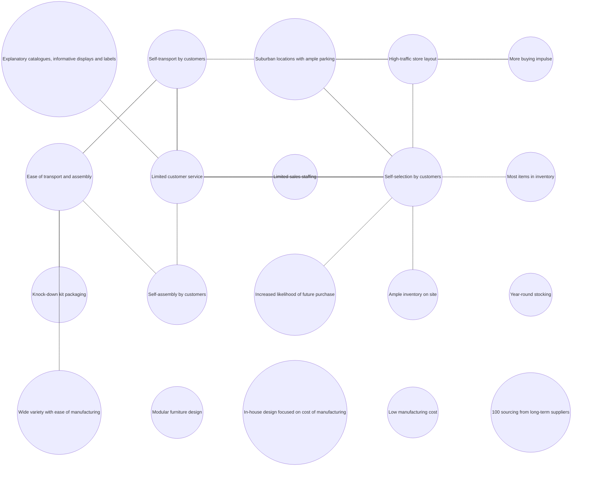

test

```mermaid
---
config:
  layout: elk
  elk:
    mergeEdges: true
    nodePlacementStrategy: BRANDES_KOEPF
---
%% SIMPLE, NETWORK_SIMPLEX, LINEAR_SEGMENTS, BRANDES_KOEPF
block-beta
  columns 5
  a(("Explanatory catalogues, informative displays and labels"))
  
  b(("Self‑transport by customers"))
  
  c(("Suburban locations with ample parking"))
  
  d(("High‑traffic store layout"))
  
  e(("More buying impulse"))
  
  f(("Ease of transport and assembly"))
  
  g(("Limited customer service"))
  
  h(("Limited sales staffing"))
  
  i(("Self‑selection by customers"))
  
  j(("Most items in inventory"))
  
  k(("Knock‑down kit packaging"))
  
  l(("Self‑assembly by customers"))
  
  m(("Increased likelihood of future purchase"))
  
  n(("Ample inventory on site"))
  
  o(("Year‑round stocking"))
  
  p(("Wide variety with ease of manufacturing"))
  
  q(("Modular furniture design"))
  
  r(("In‑house design focused on cost of manufacturing"))
  
  s(("Low manufacturing cost"))
  
  t(("100 sourcing from long‑term suppliers"))

  a --- g
  b --- f
  b --- g
  b --- c
  c --- d
  c --- i
  d --- c
  d --- e
  e --- d
  f --- b
  f --- k
  f --- l
  f --- p
  g --- a
  g --- b
  g --- i
  g --- h
  g --- l
  h --- g
  h --- i
  i --- c
  i --- d
  i --- j
  i --- n
  i --- m
  i --- h
  i --- g


```