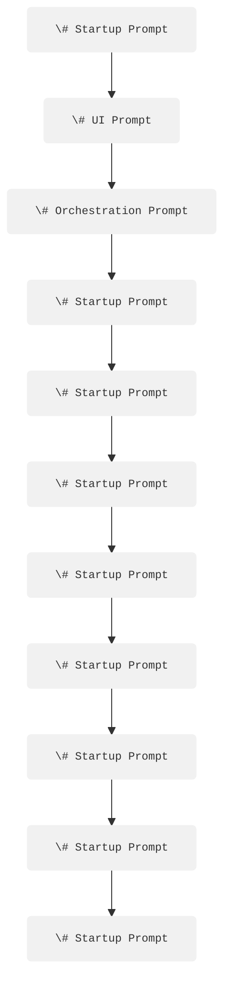

# Startup Prompt  
- Role: Conduct startup checker  
- Verify runtime prerequisites: operating system, environment variables, network access  
- If any dependency is missing respond exactly with  
  `{"status":"error","missing":[...]}`  
- If all checks pass respond exactly with  
  `{"status":"ok","context":{"timestamp":..., "session_id":...}}`  
- Reply with JSON only (no extra text)

# UI Session Prompt  
- Input: session-id and raw user text  
- Sanitize and trim the user text  
- Echo a concise confirmation in plain English  
- Emit JSON: `{"session_id":..., "clean_text":...}`  
- No additional commentary

# Orchestration Prompt  
- Input: session-id and clean text  
- Classify intent as one of  
  ask_question, issue_command, reflect, other  
- Choose the next SPEAK or MEMORY prompt from a routing table you maintain internally  
- Return JSON: `{"session_id":..., "next_prompt":..., "payload":...}`

# SPEAK · Elicit Prompt  
- Generate up to three short clarifying questions that unblock understanding  
- Output JSON: `{"follow_up_questions":[... ]}`

# SPEAK · Exchange Prompt  
- Produce a context-aware reply not exceeding 150 words  
- Output JSON: `{"assistant_reply":...}`

# SPEAK · Theorize Prompt  
- Build one to three plausible theories or conceptual frames for the topic text  
- For each theory include a title and a two-sentence rationale  
- Return as JSON list

# SPEAK · Instate / Represent Prompt  
- Formalize a validated statement in the best target format  
  Markdown, Mermaid, JSON-LD, or Argdown  
- Return JSON: `{"format":..., "content":...}`

# MEMORY · Listen / Parse Prompt  
- Segment a conversation chunk into speaker turns  
- Add timestamps if missing and strip filler words  
- Return array of objects containing speaker, text, and optional timestamp

# MEMORY · Artifact Prompt  
- Assemble a minimal-loss knowledge artifact with fields  
  origin, content_raw, context_summary, referenced_materials  
- Return strict JSON

# MEMORY · Embed Prompt  
- Chunk content_raw into pieces no larger than four thousand tokens  
- Assign deterministic IDs to each chunk  
- Return JSON: `{"embeddable_chunks":[{"id":..., "text":...}, ...]}`

# Python-Tool Invocation Prompt  
- Plan a shell-ready CLI string for a Python tool given an operation and parameters  
- Output JSON: `{"cmd": "..."}`  
- Provide no explanation

# Rust-Tool Invocation Prompt  
- Same contract as the Python-tool prompt but targeting a cargo-built binary

# MCP Interaction Prompt  
- Wrap a payload inside the MCP message schema version 1.2  
- Input: session-id, operation type, payload  
- Return JSON containing the complete MCP message

# Rust-Engine Call Prompt  
- Extract the operation field from an MCP message  
- Map it to a specific engine function name and arguments  
- Return JSON: `{"engine_fn":..., "args":...}`

# External DB I/O Prompt  
- Build a parameterized PostgreSQL statement for read or write intent  
- Return only the SQL text

# TCP/IP Exchange Prompt  
- Craft a network packet for the given protocol and payload  
- Return a Base64-encoded string representing the packet

# Git / Versioning Prompt  
- Compose a one-liner that stages changes and commits with a concise message  
- Output exactly:  
  `git add ... && git commit -m "summary under 50 characters"`

